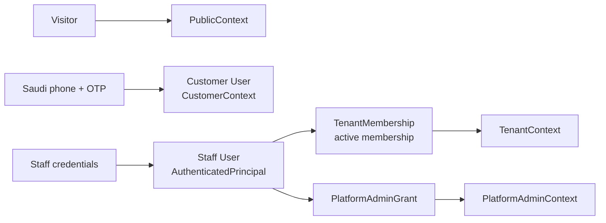
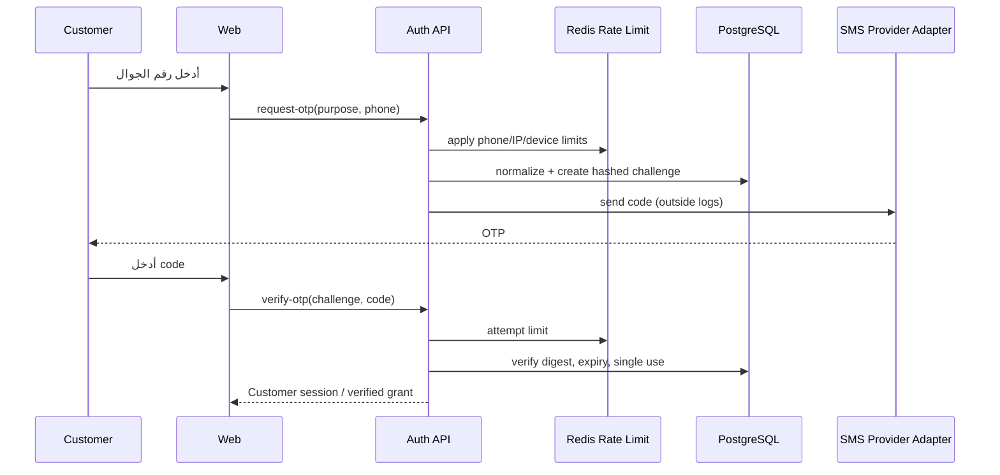

# معمارية المصادقة والهوية

> **النطاق:** هوية العميل برقم الجوال السعودي وOTP للأفعال المقيدة، وهوية موظف المعرض/مشرف المنصة عبر بيانات اعتماد مخصصة وجلسات آمنة. تبقى المصادقة مستقلة عن التفويض؛ وجود جلسة صحيحة لا يمنح صلاحية Tenant أو Admin بحد ذاته.

## 1. مبادئ التصميم

يسمح السوق العام بالتصفح والبحث بلا تسجيل. لا يطلب OTP إلا عند إنشاء customer identity أو طلب عرض سعر أو استخدام المفضلة. لا يخزن رمز OTP كنص صريح، ولا يسجل في logs أو events أو analytics. موظف المعرض يسجل دخولًا ببيانات اعتماد مخصصة؛ ويُحمى استعمال حسابه لاحقًا بـTenantContext مشتق من العضوية الفعالة، لا فقط من `userId` داخل token.

| المبدأ | قرار التصميم |
|---|---|
| فصل الهوية عن الصلاحية | `User` عالمي، و`TenantMembership` في tenancy، و`PlatformAdminGrant` منفصل. |
| أقل claims | token يحمل معرفات/نسخة جلسة ونوع principal فقط؛ لا يحمل PII أو قائمة صلاحيات طويلة غير قابلة للإبطال. |
| رموز قصيرة العمر | Access token قصير العمر؛ refresh token عشوائي ومُدوّر وقابل للإلغاء من الخادم. |
| OTP آمن ومحدود | hashing/HMAC، TTL، حد محاولات، single-use، وrate limiting متعدد الأبعاد. |
| العميل/الموظف منفصلان منطقيًا | routes وسياسات ومعدلات مختلفة؛ لا تتحول customer session إلى staff session. |
| دفاع في العمق | TLS، headers، CORS محدود، CSRF لعمليات cookie، password throttling، وسجل أمني مخفف. |

## 2. نماذج الهوية

يملك المستخدم معرفًا عالميًا عالي العشوائية، والحالة (`active`, `suspended`, وغيرها)، ومعرفات login بحسب النوع. يحتفظ رقم الجوال بصورة موحّدة (canonical E.164 للمملكة، مع validation مخصص لسياسات الرقم المعتمدة) ومشفّرة على مستوى التطبيق أو محمية حسب سياسة البيانات، مع fingerprint/hash للبحث أو منع التكرار عند الحاجة. لا تضع response DTO رقم الجوال أو credential metadata إلا حيث توجد حاجة عمل وصلاحية صريحة.

| الكيان | الحقول الجوهرية | ملاحظات أمنية |
|---|---|---|
| `User` | `id`, `kind`, `status`, timestamps | لا يساوي tenant ولا role. |
| `StaffCredential` | `user_id`, password hash، `credential_version`, last-used | Argon2id أو KDF مُعتمد بإعدادات قابلة للترقية؛ لا password plaintext. |
| `CustomerIdentity` | `user_id`, normalized phone، verified_at | لا تنشأ/تحدث الهوية إلا بعد OTP ناجح. |
| `OtpChallenge` | purpose، phone fingerprint، code digest، expiry، attempts، consumed_at | TTL قصير، single-use، لا يعيد code مرة أخرى. |
| `Session` | principal/user، token family، refresh digest، expiry، revoked_at، device metadata مخفف | لا يحفظ refresh raw token. |
| `PlatformAdminGrant` | user، scope، status، grant version | منفصل عن عضوية tenant. |

## 3. تسجيل دخول الموظف والجلسة

يقوم endpoint الموظفين بالتحقق من بيانات الاعتماد ومن حالة الحساب، ثم ينشئ session family. لا يحدد العميل في login body `tenantId` كأمر تفويض. إذا كان الموظف عضوًا في أكثر من Tenant، يمكنه اختيار active membership بعد المصادقة عبر endpoint مقيد بعضوياته فقط، أو يبدأ بسياق افتراضي موثوق؛ يعاد حل العضوية في الخادم للعمليات الحساسة.

### 3.1 سياسة الرموز المقترحة

| العنصر | الخصائص | التخزين في العميل | الإبطال |
|---|---|---|---|
| Access token | JWT موقّع، قصير العمر، `sub`, `sessionId`, `principalKind`, `credential/session version`, `jti` | الذاكرة فقط؛ لا LocalStorage | expiry، denylist قصير العمر عند الحاجة، session/credential version. |
| Refresh token | opaque random عالي entropy، token family، one-time rotation | HttpOnly + Secure cookie، `SameSite=Lax` كحد مبدئي | digest في DB، reuse detection، revoke family/device/user. |
| CSRF token | random per session أو double-submit | header/ذاكرة أو cookie غير HttpOnly حسب النمط | يعاد توليده عند session rotation. |

إذا استخدمت الواجهات وAPI نطاقات فرعية من نفس الموقع، يوثق cookie scope بدقة (`Secure`, صلاحية domain أدنى ممكنة، `Path` مقيد للـrefresh). إذا تطلب النشر cross-site cookies، يعد ذلك قرارًا أمنيًا منفصلًا يتطلب `SameSite=None`, CSRF enforced، allow-list origins دقيق، ومراجعة إضافية. لا يسمح بـ`Access-Control-Allow-Origin: *` مع credentials.

### 3.2 Refresh rotation واكتشاف إعادة الاستخدام

عند refresh صحيح، يلغي الخادم token السابق ويصدر زوجًا جديدًا مرتبطًا بالـfamily نفسه. تؤدي محاولة استعمال refresh مستبدل/مستهلك إلى إبطال family أو session بحسب سياسة المخاطر، وتسجيل security event، وإجبار login جديد عند مستوى المستخدم أو الجهاز المناسب. Logout يبطل session family في الخادم ولا يعتمد على حذف cookie وحده.

## 4. OTP للعميل

### 4.1 تدفق التحقق

يرتبط challenge بـ**purpose** واضح مثل `QUOTE_REQUEST` أو `CUSTOMER_LOGIN`، وبـphone fingerprint وربما nonce للطلب. لا يتيح verification الخاص بطلب عرض سعر استخدام grant مفتوحًا لإنشاء Leads أخرى خارج الفترة/السياق المصرح. بعد نجاح OTP، ينشئ أو يربط customer user ويصدر session أو grant محدد الغرض وفق رحلة المنتج.

### 4.2 ضوابط OTP

| التحكم | التصميم المقترح |
|---|---|
| التوليد | رمز عشوائي باستخدام CSPRNG؛ لا يعتمد على رقم الهاتف أو timestamp. |
| التخزين | digest مملح/مفتاحي (مثل HMAC بخادم secret أو KDF مناسب)، وليس OTP خامًا. |
| الانتهاء | TTL قصير قابل للضبط عبر config، ثم رفض قاطع. |
| الاستعمال | `consumed_at` ذري؛ لا يعاد استعمال الرمز أو challenge الناجح. |
| المحاولات | حد منخفض قابل للضبط لكل challenge ولكل phone/IP/device؛ lockout متدرج. |
| الإرسال | rate limits على phone hash وIP وdevice؛ response متجانس يقلل account/phone enumeration. |
| المراقبة | تسجل counts/outcome/reason codes مخففة، لا code ولا phone raw. |
| المزود | adapter + timeout + retry محدود؛ لا يغير فشل SMS semantics أو يكشف المزود. |

## 5. حماية بيانات الاعتماد

تعتمد بيانات اعتماد الموظف قواعد طول وقوة وحد أدنى policy قابل للضبط، hashing بـArgon2id مع salt فريد وإعدادات قابلة للترقية، throttling على login حسب account/IP/device، ورسائل فشل موحدة. يفضل تفعيل MFA للـPlatform Admin قبل الإطلاق الإنتاجي؛ إن لم يدخل ضمن Pilot، يسجل كخطر قبول صريح ولا يخلط مع OTP العميل.

لا توضع كلمات مرور أو refresh tokens أو OTP أو authorization headers أو cookies أو جسم CSV حساس في logs أو أخطاء. تخزن الأسرار في secret manager/runtime environment ولا تدخل Git أو `.env.example` إلا بأسماء المتغيرات.

## 6. Guards وواجهات API

| المساحة | Guard الأولي | سياق ناتج | أمثلة |
|---|---|---|---|
| `/public/*` | لا يوجد أو optional customer | `PublicContext` | search، vehicle page، dealership page. |
| `/auth/request-otp` | rate limit + validation | none | إرسال OTP دون كشف وجود مستخدم. |
| `/auth/verify-otp` | challenge/rate validation | `CustomerContext` أو purpose grant | إتمام التحقق. |
| `/auth/staff/login` | credential validation + rate limit | session principal | login موظف فقط. |
| `/tenant/*` | access guard + TenantContext resolver | `TenantContext` | vehicle/leads/branch dashboard. |
| `/admin/*` | access guard + PlatformAdmin resolver | `PlatformAdminContext` | approve/suspend/catalog. |

الـfrontend route guards والـmiddleware تحسن التجربة فقط. كل endpoint حساس يكرر التحقق في API. لا تستعمل صفحة Next.js التي تخفي زرًا دليلًا على المصادقة أو التفويض.

## 7. إدارة الجلسات والإبطال

تتيح شاشة الأمان أو API داخلي لاحق إبطال session جهاز معين أو كل sessions، بينما يبطل تغيير كلمة المرور أو تعليق المستخدم جميع عائلات refresh المرتبطة حسب policy. عند تعليق Tenant، تمنع `TenantContextResolver` استعمال عضوياته فور إعادة التحقق، ولو ظل access token لم ينته بعد. عند إلغاء عضوية، يحفظ membership/version أو status ليكتشفه resolver ولا يعتمد على role claim قديم.

| الحدث | التأثير المطلوب |
|---|---|
| logout | revoke refresh family + حذف cookie + audit/security event مخفف. |
| refresh reuse | revoke family، إنذار أمني، وقد يوسع الإبطال حسب policy. |
| password reset/change | increment credential/session version وإبطال refresh families. |
| staff suspended | منع login ورفض session عند guard/resolver. |
| membership revoked | لا ينشأ TenantContext حتى مع session valid. |
| tenant suspended | لا تقبل operations tenant؛ يعالج public visibility بسياسة tenancy. |

## 8. سجلات ومؤشرات أمن الهوية

تنتج `auth` structured events مثل `auth.login.succeeded`, `auth.login.failed`, `auth.otp.requested`, `auth.otp.verified`, `auth.refresh.reused`, و`auth.session.revoked`. كل event يضيف correlation ID وreason code وprincipal/user ID المقنّع عند الحاجة؛ لا يحتوي secret أو OTP أو full phone. تنبه المراقبة عند ارتفاع login/OTP failures، أو reuse detection، أو أخطاء مزود SMS، أو ارتفاع latency.

## 9. اختبارات قبول أمنية

| المعرف | التحقق |
|---|---|
| TC-AUTH-001 | OTP منتهٍ أو مستخدم أو ذو hash غير مطابق لا ينشئ session أو Lead. |
| TC-AUTH-002 | تجاوز حد المحاولات/الإرسال يعيد rate-limited response موحدًا. |
| TC-AUTH-003 | refresh القديم بعد rotation يؤدي إلى reject وإبطال policy المناسب. |
| TC-AUTH-004 | لا يظهر password/OTP/token في logs أو API errors أو traces. |
| TC-AUTH-005 | session موظف صحيح بلا Membership فعالة لا يصل لـ`/tenant/*`. |
| TC-AUTH-006 | customer token لا ينجح في endpoint موظف/admin. |
| TC-AUTH-007 | أصل CORS غير موجود في allow-list لا يحصل على credentials أو response حساس. |

## المراجع

[1]: ../PRD_MVP_Automotive_Marketplace_SaaS_Saudi_v1.0.docx "PRD — MVP: منصة موحدة لمعارض السيارات السعودية، Baseline v1.0"
[2]: ../SRS_MVP_Automotive_Marketplace_SaaS_Saudi_v1.0.docx "SRS — MVP: منصة موحدة لمعارض السيارات السعودية، Baseline v1.0"

تغطي [1] و[2] التصفح العام، OTP، بيانات اعتماد الموظفين، منع تخزين OTP كنص صريح، rate limiting، وحماية البيانات الحساسة. يجب تصحيح روابط المصدر النسبية عند إدخال الوثائق إلى المستودع الفعلي.
