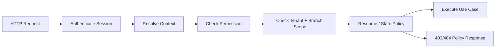

# معمارية التفويض والصلاحيات

> **القرار:** يعتمد النظام على RBAC عملي مدعوم بصلاحيات دقيقة و`branchScope` وسياسات موردية. المصادقة تثبت من هو المستخدم؛ أما التفويض فيقرر ماذا يستطيع فعلُه وأين. جميع القرارات authoritative في NestJS API، وليس في الواجهة.

## 1. نموذج التفويض

يتكون قرار الوصول من أربعة أسئلة متتابعة: هل المستخدم مصادق؟ هل له Membership/Grant نشط مناسب؟ هل يملك permission المطلوبة؟ وهل المورد يقع في tenant وbranch scope وقواعد الحالة المسموحة؟ لا يمكن اختزال ذلك في role بالواجهة أو claim `tenantId` قابل للتعديل.



| البعد | مصدر الحقيقة | مثال |
|---|---|---|
| Identity | `identity/auth` | user/session صالحة. |
| Tenant membership | `tenancy` | الموظف عضو نشط في Tenant A. |
| Role/permission | role-to-permission policy versioned | يملك `vehicles.update`. |
| Branch scope | membership assignment أو policy | يحق له تعديل سيارة في فرع الرياض فقط. |
| Resource ownership | tenant-aware repository | vehicle مع `tenant_id=A`. |
| State/business policy | unit المالكة للمجال | لا يمكن بيع Vehicle مؤرشفة. |

## 2. الأدوار الأساسية

يدعم الـMVP أدوارًا ثابتة مفهومة للمنتج: `TENANT_OWNER`, `TENANT_MANAGER`, `SALES_REPRESENTATIVE`, و`PLATFORM_ADMIN`. لا يطبق نظام roles قابلًا للتخصيص من قبل العميل في الـPilot؛ فذلك يوسع نطاق الأمن وتجربة الإدارة من دون حاجة مثبتة. تخزن memberships role وحالة وbranch scope، وتتحول إلى permissions مركزية في الخادم.

| الدور | الغرض | نطاقه |
|---|---|---|
| Tenant Owner | مسؤول المعرض وصلاحيات التشغيل العليا | tenant كله، وفق status/plan، مع إدارة الموظفين والفرع. |
| Tenant Manager | إدارة المخزون والـLeads ضمن الصلاحيات | tenant أو branches مخصصة حسب membership. |
| Sales Representative | متابعة العملاء وتنفيذ العمليات اليومية المحدودة | Leads وقراءة المخزون ضمن branch scope. |
| Platform Admin | إدارة المنصة والاعتمادات والكتالوج والجودة | منصة كاملة عبر endpoints admin منفصلة. |
| Customer | مفضلة العميل وطلب العرض بعد OTP | نفسه فقط؛ لا tenant operations. |
| Visitor | قراءة السوق العام فقط | public DTOs فقط. |

## 3. قاموس الصلاحيات

تعرف الصلاحيات على شكل `resource.action` ولا تقرأ الواجهة اسم role لتقرير السلطة. تظل الأسماء مركزية ومراجعة في package/وحدة authorization، وتُصنّف بين قراءة وتعديل وحساسة.

| المجال | صلاحيات مقترحة للـMVP |
|---|---|
| Tenant profile/branch | `tenant.read`, `tenant.update`, `branches.read`, `branches.manage` |
| Employees | `members.read`, `members.invite`, `members.update_role`, `members.deactivate` |
| Vehicles | `vehicles.read`, `vehicles.create`, `vehicles.update`, `vehicles.archive`, `vehicles.publish` |
| Inventory | `inventory.confirm_availability`, `inventory.reserve`, `inventory.release_reservation`, `inventory.mark_sold`, `inventory.adjust_price` |
| Leads | `leads.read`, `leads.update_status`, `leads.assign`, `leads.read_contact` |
| Imports | `imports.create`, `imports.read`, `imports.commit` |
| Catalog admin | `catalog.read`, `catalog.manage` |
| Platform operations | `tenants.review`, `tenants.approve`, `tenants.suspend`, `vehicles.moderate`, `plans.manage`, `analytics.platform.read` |
| Audit | `audit.tenant.read`, `audit.platform.read` |

| الحساسية | المعالجة المطلوبة |
|---|---|
| اعتيادية | session + permission + tenant/branch scope. |
| تؤثر في الظهور العام | policy حالة + tenant status + Audit/outbox. |
| تؤثر في وصول موظف | owner/admin فقط، no-self-escalation، Audit. |
| إدارية عابرة للـtenant | PlatformAdminContext منفصل، سبب عند اللزوم، Audit متزامن. |
| تتضمن PII | permission محددة وDTO أقل بيانات، وحظر في logs. |

## 4. مصفوفة RBAC الأساسية

> يظل السماح النهائي رهينًا بـtenant status وbranch scope والسياسات الموردية. العلامة **محدود** تعني أن العملية لا تسمح بتجاوز الحقول أو الحالات المحددة في use case.

| القدرة | Owner | Manager | Sales Representative | Platform Admin | Customer |
|---|---:|---:|---:|---:|---:|
| رؤية Dashboard الخاص بالمعرض | نعم | نعم | محدود | عبر admin aggregates فقط | لا |
| إنشاء/تعديل Vehicle | نعم | نعم | حسب policy، افتراضيًا لا | moderation فقط | لا |
| نشر/أرشفة Vehicle | نعم | نعم | لا | إيقاف/تعليق وفق policy | لا |
| تأكيد توفر فردي/جماعي | نعم | نعم | محدود وفق assignment/policy | لا | لا |
| حجز/فك/بيع Vehicle | نعم | نعم | محدود وفق policy | moderation فقط | لا |
| رؤية Leads | نعم | نعم | فقط المعيّنة أو branch scope | مؤشرات/تحقيق مصرح | لا |
| تغيير حالة Lead | نعم | نعم | المعيّنة أو branch scope | لا | لا |
| إسناد Lead | نعم | نعم | لا | لا | لا |
| إدارة الموظفين والأدوار | نعم | محدود؛ لا owner ولا تصعيد | لا | لا | لا |
| تعديل الفرع/ملف Tenant | نعم | محدود | لا | review/suspend فقط | لا |
| إدارة catalog | لا | لا | لا | نعم | لا |
| اعتماد/تعليق Tenant | لا | لا | لا | نعم | لا |
| المفضلة/طلب عرض سعر | لا | لا | لا | لا | نفسه فقط |

لن تعتمد هذه المصفوفة على route-level فقط. مثلاً قد يحمل Manager `vehicles.update`، لكنه لا يستطيع تعيين Vehicle إلى branch خارج `branchScope` أو نشر Tenant غير معتمد أو تجاوز حد plan.

## 5. سياسات الموارد

ينفذ التفويض الدقيق في application layer بجانب repository scoped. لا تصح قاعدة عامة من نوع "لو كان user هو owner فاسمح"؛ بل تصمم policy بحسب المورد والعملية.

| المورد/الأمر | سياسة إلزامية |
|---|---|
| `Vehicle.update` | Vehicle ضمن TenantContext، branch الحالي والجديد مسموحان، الحقول المسموحة مرتبطة بالpermission، ولا انتقال ضمني للحالة. |
| `Vehicle.publish` | tenant verified/active، اكتمال حقول/صور حسب policy، publication transition صالح، وحدود الخطة لم تتجاوز. |
| `Inventory.markSold` | vehicle ضمن tenant، actor يملك permission، state transition صالح، يغلق reservation، يمنع Leads جديدة، Audit. |
| `Lead.assign` | Lead ضمن tenant، assignee Membership نشطة داخل tenant ونطاقه/دوره يتيح الاستلام. |
| `Lead.read_contact` | permission PII + ownership/branch assignment؛ لا تعرض phone في list DTO بلا حاجة. |
| `Member.update_role` | لا تعديل ذاتي لرفع الصلاحية، ولا خفض/تعطيل آخر Owner فعال، ولا منح Platform Admin عبر tenant route. |
| `Admin.suspendTenant` | PlatformAdminContext، tenant target صريح، سبب/actor/audit، side effects عبر outbox. |
| `Import.commit` | import ضمن tenant، actor permission، status جاهز، idempotency، دوبل لا ينفذ مرتين. |

## 6. من Context إلى قرار التفويض

يستقبل controller principal مصادقًا، ثم يحول resolver إلى context صحيح. لا يمر `roles`, `permissions`, `tenantId`, أو `branchScope` من body. تثبت decorator/guard permission المعلنة، ثم ينجز use case policy الموردية لأن guard غالبًا لا يملك الكائن أو حالته.

```text
@RequirePermission("inventory.mark_sold")
POST /tenant/vehicles/:id/mark-sold
  → AccessGuard ينشئ TenantContext
  → InventoryApplicationService.markSold(context, vehicleId, command)
  → TenantAwareVehicleRepository.findById(context, vehicleId)
  → InventoryPolicy.assertTransition(...)
  → transaction + audit/outbox
```

المثال توضيحي بنيوي فقط، ولا يمثل كود تنفيذ أو API نهائيًا.

## 7. فصل Platform Admin عن Tenant

لا يعد Platform Admin عضوًا تلقائيًا في كل Tenant ولا يقبل `TenantContext` مصطنعًا. تستخدم مساحة `/admin/*` context منفصلاً وصلاحيات Platform دقيقة. عند الحاجة إلى قراءة/تعديل متعلق بمعرض، تستدعي admin application service capability للمالك وتضع actor context وسببًا في AuditLog. بهذه الطريقة تبقى عملية العبور مرئية وقابلة للمراجعة ولا تصبح shortcut لاستعلامات غير مقيدة.

| السلوك | مرفوض | معتمد |
|---|---|---|
| إدارة Tenant | admin يستعمل tenant route مع tenantId مزيف | admin capability + PlatformAdminContext + audit. |
| دعم عميل | موظف المنصة يدخل كـTenant Owner | impersonation رسمي محدود، سبب، موافقة/مدة، audit؛ خارج MVP ما لم يعتمد. |
| وصول بيانات Leads | admin يعرض كل PII افتراضيًا | aggregate افتراضي؛ وصول فردي مبرر وصلاحية PII عند الحاجة. |
| إدارة roles | membership يضيف `PLATFORM_ADMIN` | grant مستقل محمي خارج tenancy. |

## 8. منع IDOR والتسرب

كل endpoint يقبل resource ID تابعًا لمستأجر يستخدم lookup scope في repository. لا يغير إرسال body بقيمة `tenantId` أو `branchId` أي شيء في scope. لا تعيد response error `Tenant B owns vehicle X`; بل تتبع سياسة 404/403 موحدة. يجب تغطية all list endpoints أيضًا: فالـIDOR ليس محصورًا بصفحة تفاصيل.

تتبع DTOs مبدأ أقل امتياز. تعيد قائمة Leads ملخصًا لا يشمل رقم هاتف كاملًا إلا حين تكون `leads.read_contact` مصرحًا بها وفي صفحة detail أو action يحتاجه. وتفصل public vehicle/dealership DTOs عن DTOs لوحة المعرض حتى إذا تغيرت schema لا تتسرب الحقول بالصدفة.

## 9. إدارة تغيرات الصلاحيات

تظل تعريفات roles-permissions versioned ومراجعة في الكود/config المحمي. عندما يتغير role أو branch scope أو حالة membership، ينعكس التغير في resolver عند الطلب التالي ولا ينتظر token طويل العمر. يمكن cache membership لفترة قصيرة مع invalidation event، لكن لا cache قرار تفويض ينسخ بين tenants أو actors من دون مفاتيح كاملة تشمل `userId`, `membershipId`, `permission`, `tenantId`, `branchScope version`.

| التغيير | التحقق/الإبطال |
|---|---|
| تغيير Role | increment membership version + invalidate context cache. |
| تغيير branch scope | invalidate membership/context cache فورًا. |
| تعليق Tenant | resolver يرفض contexts ويصدر invalidation للجلسات/caches. |
| إزالة Membership | لا يحل resolver context حتى لو token صالح. |
| تغيير permission catalog | deployment/config version + tests للمصفوفة والسياسات. |

## 10. Audit للأفعال المفوضة الحساسة

يسجل audit العملية الحساسة مع `actorType`, `actorId`, `tenantId` عند وجوده، `action`, `resourceType`, `resourceId`, `correlationId`, timestamp، وdelta مخفف. لا يسجل token أو OTP أو password أو هاتف كامل أو صور/CSV في before/after. تكتب أفعال مثل تغيير role، تعليق tenant، نشر/بيع/أرشفة سيارة، تغيير السعر، وتغيير إسناد Lead في نفس transaction ما أمكن.

## 11. اختبارات التفويض الأساسية

| المعرف | سيناريو | النتيجة |
|---|---|---|
| TC-AUTHZ-001 | Sales Rep يحاول `members.update_role` | رفض قبل تغيير بيانات. |
| TC-AUTHZ-002 | Manager يرفع دوره أو دورًا إلى Owner خارج policy | رفض + audit attempt اختياري. |
| TC-AUTHZ-003 | Manager في Branch A يعدل Vehicle Branch B | رفض/عدم العثور وفق سياسة endpoint. |
| TC-AUTHZ-004 | Tenant A يمرر vehicleId من B | لا قراءة ولا تعديل ولا كشف ملكية. |
| TC-AUTHZ-005 | Platform Admin يستدعي endpoint tenant مباشرة | رفض؛ يجب admin context/capability. |
| TC-AUTHZ-006 | Customer يطلب Lead list أو status update | رفض قاطع. |
| TC-AUTHZ-007 | إسناد Lead لموظف Tenant آخر | يفشل policy/database invariant. |
| TC-AUTHZ-008 | تغيير role يبطل authorization cache | الطلب التالي يعكس الصلاحيات الجديدة. |

## المراجع

[1]: ../PRD_MVP_Automotive_Marketplace_SaaS_Saudi_v1.0.docx "PRD — MVP: منصة موحدة لمعارض السيارات السعودية، Baseline v1.0"
[2]: ../SRS_MVP_Automotive_Marketplace_SaaS_Saudi_v1.0.docx "SRS — MVP: منصة موحدة لمعارض السيارات السعودية، Baseline v1.0"

تعالج [1] و[2] أدوار المالك والمدير والمندوب والمشرف، العزل بين المستأجرين، branch scope، وقيود الوصول إلى المخزون وLeads. يجب تصحيح روابط المصدر النسبية عند إدخال الوثائق إلى المستودع الفعلي.
