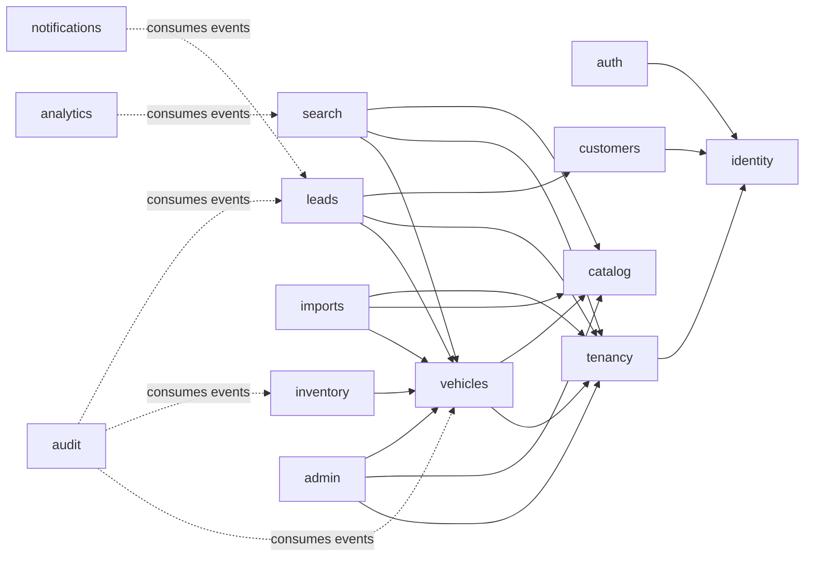

# حدود الوحدات وقواعد الاعتماد

> **الحالة:** تصميم مستهدف للـMVP. لا يصف هذا الملف بنية كود قائمة؛ لم يتوفر المستودع أو تقارير تحليل الحالة عند إعداد المراجعة.

## 1. الهدف

تقسم الخدمة الخلفية إلى وحدات ذات **ملكية بيانات ومسؤوليات محددة**. الهدف هو إبقاء الـModular Monolith قابلاً للفهم والاختبار والنقل المستقبلي إلى وحدات تشغيلية مستقلة إذا ظهرت ضرورة مثبتة، مع المحافظة على المعاملات العلائقية البسيطة للـMVP. الوحدة ليست مجلدًا فقط: هي حد للـAPI الداخلي، وللقواعد، وللوصول إلى البيانات، وللاختبارات.

## 2. تصنيف الوحدات

| الفئة | الوحدات | القاعدة |
|---|---|---|
| Platform/Core | `auth`, `identity`, `tenancy`, `authorization`, `audit`, `config`, `health` | تملك مفاهيم المنصة المساندة ولا تعتمد على تفاصيل السوق أو المخزون. |
| Reference data | `catalog` | بيانات عالمية ثابتة نسبيًا؛ لا تحمل `tenant_id`. |
| Tenant domain | `vehicles`, `inventory`, `leads`, `imports`, `customers` | لا تعمل بلا `TenantContext` في المسارات الداخلية. |
| Public read | `search`, `public-marketplace` | يعرض DTOs عامة فقط ويطبق سياسة النشر من مصدرها الموثوق. |
| Platform operations | `admin`, `analytics`, `notifications` | قدرات منصة مقيدة، أو مستهلكات أحداث غير مالكة للحالة الأساسية. |

## 3. خريطة ملكية البيانات

| الوحدة | تملك كتابة | تقرأ عبر | ملاحظات العزل |
|---|---|---|---|
| `identity` | User، credential، customer identity، staff identity، session metadata | public port فقط | لا تملك عضوية Tenant أو صلاحياته. |
| `auth` | OTP challenge، refresh token family، login attempts | `identity` port وRedis adapter | OTP hashed فقط، وسجلات قصيرة العمر. |
| `tenancy` | Tenant، TenantMembership، Branch، tenant plan/limits، tenant status | repositories خاصة بها | كل branch مثبت على tenant؛ لا تُنشأ عضوية من الوحدة الأخرى مباشرة. |
| `catalog` | City، Brand، Model، Trim، body/fuel/transmission references | public read port | بيانات عالمية، ولا تُنسخ لكل Tenant. |
| `vehicles` | Vehicle الأساسية، VehicleImage metadata، vehicle publication state | catalog/tenancy read ports | يتحقق من branch وtenant في transaction واحدة. |
| `inventory` | availability confirmation، reservation، sold/unavailable transitions، pricing history | vehicles application port | يملك آلة الحالات وليس controller أو `vehicles` PATCH عام. |
| `search` | لا يملك المصدر الأساسي؛ قد يملك read/cache projection | public ports من vehicles/tenancy/catalog | يعيد `Public*DTO` فقط ويطبق policy مركزية. |
| `customers` | Customer profile وfavorites عند تحقق OTP | identity/auth ports | بيانات العميل لا تصبح متاحة لموظف tenant بلا policy محددة. |
| `leads` | Lead، LeadActivity، assignment/status history | vehicles/tenancy/customers ports | ينشئ Lead تحت tenant والفرع والسيارة المتطابقة. |
| `imports` | ImportJob، row errors، import mapping/status | vehicles/catalog/tenancy ports | الملفات عبر storage adapter؛ consumer idempotent. |
| `notifications` | delivery attempt/log اختياري | domain events وprovider adapter | لا يغير المصدر التجاري؛ عمليات retry فقط. |
| `audit` | append-only AuditLog/Outbox event | event contract | يسجل actor/action/resource/correlation/tenant عند اللزوم. |
| `analytics` | aggregate/event projection | analytics events | لا يقرأ جداول tenant خامًا من الواجهة العامة. |
| `admin` | لا يملك جدولًا تجاريًا مستقلًا بالضرورة | capabilities من tenancy/catalog/vehicles | ينفذ كـPlatformAdminContext ويكتب Audit إلزاميًا. |

## 4. تعريفات الوحدات الأساسية

### 4.1 `auth`

تدير فقط إثبات الهوية والـsessions: OTP للعميل، login آمن للموظف، refresh rotation، logout، rate limits، وحالات التحقق. لا تقرر دور موظف ولا تعالج إنشاء Lead. بعد المصادقة تصدر claims دنيا قابلة للتحقق، بينما يجلب guard السياق الحالي من مصدر موثوق عند الطلب الحساس.

### 4.2 `identity`

تدير الشخص/الحساب على مستوى المنصة وتطبيع رقم الجوال السعودي. تفصل المستخدم عن عضوية المعرض: يمكن لمستخدم واحد أن يملك عضوّيات متعددة ولا يترتب على وجوده قبول ضمن tenant. لا تخزن وحدة أخرى كلمة المرور أو تجزئة OTP أو session secret.

### 4.3 `tenancy`

هي مصدر الحقيقة لـTenant وحالة الاعتماد والتعليق والعضويات والأدوار وbranch scope والفروع والخطط/الحدود. توفر `TenantContextResolver` وread ports للتحقق من `tenantId + branchId` وmembership status. لا يسمح لأي وحدة بإدخال TenantId من body لتجاوز هذه الحدود.

### 4.4 `catalog`

مصدر الحقيقة لمدن المملكة وBrands وModels والخصائص المرجعية. توفر ports للبحث والتحقق، وتخضع عمليات الكتابة الإدارية لواجهة `admin`. لا تحمل نسخًا tenant-local من Brand أو Model أو City.

### 4.5 `vehicles`

تملك تعريف السيارة وخصائصها وصورها وحالة النشر المنشقة عن التوفر. تتحقق من اكتمال شروط النشر ومن أن `branchId` يتبع نفس tenant. لا تملك تغيير Sold/Reservation/confirmation؛ تفوض ذلك إلى `inventory` عبر commands.

### 4.6 `inventory`

تملك قواعد توافر السيارة وتاريخ التأكيد والحجز والبيع والإخفاء وتاريخ السعر. تنفذ انتقالات مقيدة مثل `ConfirmAvailability`, `ReserveVehicle`, `ReleaseReservation`, `MarkSold`, و`Archive`. عند البيع توقف الحجوزات وتمنع Leads الجديدة وتصدر حدثًا بعد commit. لا يسمح بـPATCH حر لـAvailabilityStatus.

### 4.7 `search`

تُعرّف query contract للفلاتر والترتيب والصفحات وتحول النتائج إلى DTO عام. تستدعي policy واحدة تثبت tenant verified/active وpublication published وavailability eligible. قد تستخدم view مادية أو cache لكن المصدر النهائي يظل PostgreSQL. لا تعيد tenant internal ID أو stock notes أو بيانات موظفين.

### 4.8 `customers`

تفصل رحلة العميل عن موظفي المعارض. تدير customer profile والمفضلة، وتطلب إثبات OTP قبل العمليات المقيدة. لا تسمح لعضو tenant بتعداد العملاء إلا من خلال الـLead ومبدأ أقل بيانات لازمة.

### 4.9 `leads`

تنشئ request quote بصورة ذرية مع `vehicleId → tenantId + branchId` المستنتجة من السيارة المؤهلة، لا من payload. تفرض أن الإسناد لموظف نشط من نفس tenant وأن الانتقال بين حالات Lead صالح. تحفظ `LeadActivity` لكل حدث مؤثر وتصدر events للإشعار والتحليلات.

### 4.10 `imports`

تدير دورة import من قبول الملف والتحقق منه إلى parsing وstaging وreporting وcommit. تحفظ صفوف الخطأ بمعزل عن البيانات الحية، ولا تسمح لصف غير صالح بإفساد العملية. worker لا ينفذ import إلا بعد إعادة حل TenantContext/tenant status من بيانات الرسالة الموقعة أو المفاتيح الداخلية.

### 4.11 `notifications`

تغلف مزودي SMS/WhatsApp/e-mail في adapters. مدخلها domain event أو command مصرح به؛ لا تعتمد وحدة inventory أو leads مباشرة على SDK خارجي. تحفظ idempotency key ونتيجة المحاولة من دون تضمين OTP أو محتوى حساس في logs.

### 4.12 `audit` و`analytics`

يسجل `audit` الفاعل والعمل والحالة قبل/بعد بصيغة مخففة وآمنة وسياق tenant/correlation. يملك append-only storage وسياسات retention. أما `analytics` فيستهلك أحداثًا حقلية منخفضة الحساسية ويحتفظ بإسقاطات/تجميعات تدعم مؤشرات الـPilot، ولا يصنع مصدر حقيقة للـLead أو المخزون.

### 4.13 `admin`

توفر هذه الوحدة use cases إدارية فقط: اعتماد/تعليق Tenant، إدارة catalog، إيقاف سيارة، ضبط حدود Pilot، وقراءة المقاييس. تستعمل capabilities صريحة للوحدات المالكة بدل الوصول المباشر إلى schema، وتكتب Audit event متزامنًا ضمن العملية الحساسة.

## 5. الرسم التكاملي

الأسهم الصلبة هي application/read ports منظمة. الأسهم المتقطعة أحداث integration داخل الـmonolith بعد commit. يحظر على `audit`, `analytics`, و`notifications` إنشاء دورة اعتماد عائدة إلى وحدة المصدر.

## 6. عقد التكامل الداخلي

تستخدم العقود أسماء دلالية صغيرة، مثل `BranchScopeVerifier`, `CatalogLookup`, `VehicleEligibilityQuery`, `TenantMembershipResolver`, و`LeadAssignmentPolicy`. تُصدر الوحدة contract من واجهتها العامة ويُسجّل implementation في composition root؛ ولا يستورد المستهلك Prisma type أو repository implementation للوحدة الأخرى.

| حالة التكامل | الآلية المفضلة | مثال |
|---|---|---|
| تحقق متزامن حرج | application port ضمن transaction | تأكيد أن branch ينتمي للـtenant قبل إنشاء Vehicle. |
| تغيير عبر حدود مجال | command/application service | بيع Vehicle من `inventory` مع إيقاف الحجز. |
| side effect غير حرج | outbox/domain event + BullMQ | invalidation للـcache أو إشعار Lead. |
| قراءة عامة مركبة | query service / read model | نتائج search مع city/brand/model/tenant public fields. |
| عملية إدارية حساسة | capability مخصصة + Audit | تعليق Tenant وإخفاء مركباته public. |

## 7. قواعد الحماية من التبعيات الخاطئة

1. لا يحق لأي وحدة سوى `tenancy` إنشاء/تعديل Tenant أو Membership أو Branch.
2. لا يحق سوى `vehicles` الكتابة إلى metadata السيارة، وسوى `inventory` الكتابة إلى انتقالات التوفر والحجز والبيع.
3. لا يحق سوى `leads` إنشاء Lead أو تغيير حالته أو إسناده؛ ولا يسمح بإنشاء Lead من controller مباشرة.
4. لا تمرر `PrismaClient` بين الوحدات ولا تصدّر repositories الخاصة.
5. كل application port يتلقى `TenantContext` حيث تتعلق العملية بموارد tenant. الاستثناءات العامة والإدارية تكون صريحة بنوع context آخر.
6. ترفض lint/module-boundary tests imports من `infrastructure` لوحدة أخرى ومن `database` خارج repository layer.
7. يعامل كل event كبيان حساس محتمل: يتضمن أقل حقول لازمة و`eventId`, `occurredAt`, `correlationId`, و`tenantId` عند الانتماء للـtenant.

## 8. الاختبارات المعمارية اللازمة قبل أي Feature

| الاختبار | يثبت |
|---|---|
| Import graph test | عدم وجود cycles أو imports محظورة بين layers/packages. |
| Tenant isolation integration test | Tenant A لا يقرأ أو يعدل Vehicle/Lead لـTenant B. |
| Branch invariant test | لا يمكن ربط Vehicle بفرع خارج tenant. |
| Public DTO contract test | لا تتسرب الحقول الداخلية من search/public vehicle/dealership endpoints. |
| State transition unit test | Sold/Reserved/Unconfirmed لا يمكن تجاوز قواعدها عبر PATCH عام. |
| Outbox idempotency test | إعادة تنفيذ رسالة لا تكرر إشعارًا أو تغير حالة تجارية مرتين. |

## المراجع

[1]: ../PRD_MVP_Automotive_Marketplace_SaaS_Saudi_v1.0.docx "PRD — MVP: منصة موحدة لمعارض السيارات السعودية، Baseline v1.0"
[2]: ../SRS_MVP_Automotive_Marketplace_SaaS_Saudi_v1.0.docx "SRS — MVP: منصة موحدة لمعارض السيارات السعودية، Baseline v1.0"

تعتمد حدود الوحدات على متطلبات العزل، الفروع، المخزون، التوفر، Leads، الإدارة، والاختبارات الواردة في [1] و[2]. يجب تصحيح روابط المصدر النسبية عند إدخال الوثائق إلى المستودع الفعلي.
