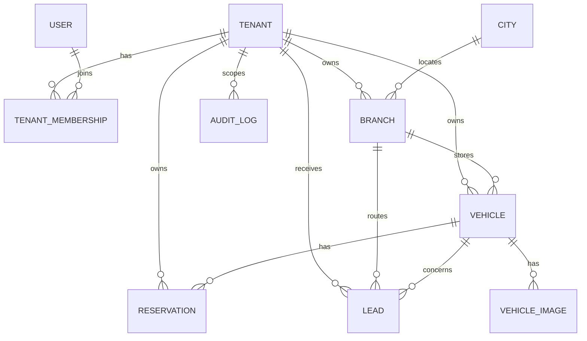
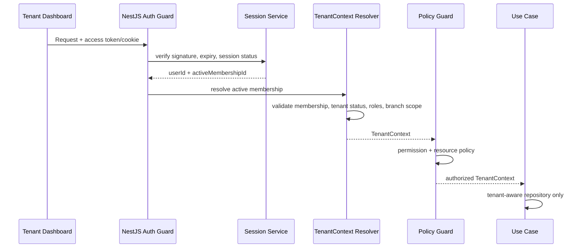

# معمارية تعدد المستأجرين والعزل

> **القرار:** Shared Database + Shared Schema + `tenant_id` لكل بيانات المعارض في الـMVP، مع عزل متعدد الطبقات وواجهة `TenantDataSourceResolver` تمهيدية للفصل المستقبلي. لا يعتمد النظام على RLS وحده ولا على `tenantId` المرسل من العميل.

## 1. مبادئ غير قابلة للتفاوض

يتعامل النظام مع كل معرض أو مجموعة معارض بوصفه Tenant مستقلاً. كل مورد تشغيلي تابع لمعرض يجب أن يحمل `tenant_id`، وكل عملية موظف يجب أن تبدأ بـ`TenantContext` مشتق من session موثوقة وعضوية فعالة. لا يملك route param أو body أو query قدرة على اختيار tenant أو توسيع scope.

> **قاعدة العزل:** مطابقة المعرف وحده ليست صلاحية. لا يكفي `WHERE id = :id` لمورد tenant؛ يجب أن يكون lookup مقيدًا بـ`tenant_id` المستنتج من السياق، أو يمر من Repository لا يسمح بغير ذلك.

| نوع البيانات | أمثلة | `tenant_id` | مبدأ الوصول |
|---|---|---:|---|
| عالمية | City، Brand، Model، FuelType، BodyType | لا | قراءة عامة أو إدارة Platform Admin. |
| خاصة بالمنصة | User، session، OTP challenge، PlatformAdminRole | بحسب النموذج | محكومة بـidentity/auth/admin. |
| خاصة بالمستأجر | Branch، Vehicle، VehicleImage، Lead، Membership، Reservation، Import، Settings، AuditLog | نعم | TenantContext إلزامي. |
| عامة مشتقة من tenant | Public Vehicle/Dealership projections | منشأها يحتويه؛ قد لا تعرضه | تظهر فقط وفق publication/availability/tenant policy. |

## 2. نموذج بيانات العزل



الحد الأدنى المقترح للبيانات tenant-scoped هو: `tenant_id UUID NOT NULL`, `id UUID/UUIDv7`, `created_at`, `updated_at`، وفهارس تتصدرها `tenant_id` حيث تكون القراءة داخل اللوحة. يحتفظ `Vehicle` أيضًا بـ`branch_id`، لكن وجود `tenant_id` المكرر مقصود لحماية الاستعلامات والأداء ولأن الـvehicle مورد داخلي تابع للمستأجر، لا مجرد فرع.

| القيد | التنفيذ المقترح | الغرض |
|---|---|---|
| مخزون فريد لكل معرض | `UNIQUE (tenant_id, stock_number)` | يحقق قاعدة العمل من دون جعل رقم المخزون عالميًا. |
| اتساق vehicle/branch | FK مركب: `(tenant_id, branch_id)` إلى `branch(tenant_id, id)` مع unique داعم | يمنع في طبقة البيانات ربط سيارة بفرع Tenant آخر. |
| اتساق lead | FKs مركبة مماثلة للمركبة والفرع حيث يسمح التصميم | يمنع Lead متناقض الانتماء. |
| role/membership فريد | `UNIQUE (tenant_id, user_id)` | يمنع العضويات المكررة. |
| فهرسة اللوحة | `(tenant_id, status, updated_at DESC)` أو فهارس وفق query الفعلي | يقلل full scans ويثبت tenant scope. |
| فهرسة البحث العام | فهارس policy/filter مثل publication/availability/branch/city والسعر/السنة بحسب EXPLAIN | يدعم البحث دون كشف داخلي. |

لا يكفي Prisma relation وحده لحماية invariant المركب. يجب أن تُترجم القيود إلى migrations صريحة قابلة للمراجعة، وتُغطى باختبارات integration ضد PostgreSQL حقيقي.

## 3. `TenantContext`

### 3.1 العقد المنطقي

```text
TenantContext {
  kind: "tenant";
  tenantId: UUID;
  userId: UUID;
  membershipId: UUID;
  roles: Role[];
  permissions: Permission[];
  branchScope: "ALL" | { branchIds: UUID[] };
  tenantStatus: "ACTIVE";
  issuedAt: Instant;
  correlationId: string;
}
```

هذا تمثيل تصميمي وليس كودًا جاهزًا. لا يحمل الـcontext أسرارًا أو profile كاملاً أو قائمة كائنات business. تحمل الجلسة claim معرف المستخدم وsession/family/version، ومعرف العضوية النشطة إن اختيرت؛ يعيد resolver جلب أو cache membership وtenant status وpermissions قصيرة العمر. يوازن ذلك بين قابلية الإلغاء الفوري تقريبًا وبين عدم تضمين صلاحيات قديمة في JWT طويل العمر.

| السياق | من أين يستخرج | ما يصرح به |
|---|---|---|
| `TenantContext` | session موظف + Membership نشطة + tenant/role status | موارد المعرض ضمن branch scope. |
| `CustomerContext` | OTP-verified customer session | مفضلة العميل وطلب العرض نيابة عن هويته فقط. |
| `PublicContext` | anonymous request | نشر عام مؤهل فقط. |
| `PlatformAdminContext` | session مشرف + Platform Admin grant | عمليات المنصة المحددة، مع Audit. |
| `SystemContext` | worker/service credential داخلي | job معين بعد التحقق من tenantId وidempotency. |

### 3.2 سلسلة إنشاء السياق



إذا لم تكن هناك عضوية نشطة أو كان tenant معلقًا أو انتهت العضوية، تعاد استجابة مصرح بها وغير كاشفة. لا يستنتج tenant من subdomain أو slug أو payload في الـMVP. يمكن استخدام slug عامة لاختيار صفحة عامة للمعرض، لكنها لا تنشئ صلاحية داخلية.

## 4. طبقات الإنفاذ

### 4.1 طبقة النقل API

تتحقق guards بالترتيب: authentication، نوع السياق، tenant status، permission، branch scope، ثم policy للكائن عند الحاجة. يدخل `tenantId` في payload فقط للحالات الإدارية الصريحة أو العامة التي تصفه كمعرّف ناتج، ولا يقرأه tenant controller لاختيار نطاق query.

### 4.2 طبقة التطبيق

كل command/query tenant-scoped يطلب `TenantContext` parameter غير اختياري. تسند use cases السياق إلى transaction ولا تقبل primitive `tenantId` بديلًا. إذا اختار الموظف Branch في الواجهة، تتأكد الخدمة أن branch يقع ضمن `context.branchScope` وداخل tenant قبل التعديل أو الاستعلام.

### 4.3 طبقة الوصول للبيانات

تطبق repositories دوالًا مقيدة مثل `findById(context, id)`, `list(context, criteria)`, و`update(context, id, patch)`. لا تصدر APIs مثل `findUnique(id)` لموارد tenant. يكشف عدم وجود مورد أو عدم التصريح برسالة 404 موحدة في endpoints المفردة حين يكون ذلك أفضل لمنع enumeration، أو 403 وفق سياسة endpoint موثقة؛ لا يكشف أبدًا tenant مالك المورد.

### 4.4 طبقة قاعدة البيانات

تفرض FKs المركبة وUNIQUE وNOT NULL وقيود الحالة. يوصى بتقييم PostgreSQL RLS بعد تثبيت repository abstraction: تفعّل RLS على الجداول الحساسة في اتصال API محدد الدور، وتضبط `app.current_tenant_id` داخل transaction موثوق. لا يفعل RLS شيئًا للـadmin/worker إن كانت أدواره تتجاوزه، ولذلك يظل scoping في التطبيق إلزاميًا.

| طبقة | ما تمنعه | ما لا تستبدله |
|---|---|---|
| JWT/session verification | انتحال المستخدم والجلسة المنتهية | عضوية tenant/branch الحالية. |
| TenantContext + policy | تغيير tenantId أو تجاوز الدور/branch | قيود الربط العلائقي. |
| Repository scoping | IDOR في queries المعتادة | سلوك worker أو cache keys. |
| PostgreSQL constraints | علاقات cross-tenant غير صالحة | Authorization. |
| RLS دفاعي | query عارضة غير مقيّدة من role التطبيق | validation أو audit أو سياسة أعمال. |
| Tests cross-tenant | regression بعد تغيير الكود | الضمان التشغيلي وحده. |

## 5. أنماط الوصول الآمنة وغير الآمنة

| النمط | التقييم | السبب |
|---|---|---|
| `findVehicle(context, id)` يضيف `tenant_id=context.tenantId` | سليم | tenant scope خادم المصدر. |
| `updateVehicle({ id, tenantId: body.tenantId })` | محظور | العميل يتحكم بالنطاق. |
| `findUnique({ id })` ثم مقارنة tenant لاحقًا | مرفوض | يكشف وجود المورد ويسهل خطأ نسيان المقارنة. |
| `findFirst({ id, tenantId: context.tenantId })` | مقبول كحد أدنى | يعزل lookup؛ الأفضل تغليفه في repository. |
| join `Vehicle` إلى `Branch` على `branch_id` فقط | غير كافٍ | يجب ضمان اتساق tenant في schema وquery. |
| admin command بسبب claim `isAdmin` عام | غير كافٍ | يلزم PlatformAdminContext وقدرة دقيقة وAudit. |

## 6. العزل خارج قاعدة البيانات

### 6.1 Redis وCache

يجب أن يحمل كل cache داخلي اسم نطاق ومفتاحًا tenant-aware، مثل `tenant:{tenantId}:vehicle:{id}:v{version}`. لا تُخزّن استجابة dashboard أو lead list تحت مفتاح يقبل id فقط. أما نتائج public search فتملك keys بحسب filter hash وpublic policy version ولا تتضمن بيانات داخلية؛ ويطهرها event عند تغير أهلية السيارة.

### 6.2 التخزين الكائني

يجب أن تنشأ المفاتيح من الخادم بصيغة مثل `tenants/{tenantId}/vehicles/{vehicleId}/{assetId}/{variant}`. لا يقبل API `storageKey` اختياريًا من العميل كمسار نهائي. يتحقق finalize endpoint أن metadata/asset owner/tenant متطابقة، وأن الكائن في prefix المتوقع. تفصل ملفات الاستيراد تحت `tenants/{tenantId}/imports/{importId}/source` مع مدة احتفاظ وسياسة وصول خاصة.

### 6.3 BullMQ والـJobs

كل job متعلق بمعرض يحمل `tenantId`, `actor/userId` عند الحاجة، `resourceId`, `eventId/idempotencyKey`, ونسخة payload. عند التنفيذ يعيد worker حل tenant status والمورد ضمن transaction، ولا يستعمل input job للوصول غير المقيد. تميز queue names بين `public`, `tenant`, و`system` ولا تعتمد أولوية tenant من مدخلات العميل بلا سقوف.

### 6.4 Logs وAnalytics

يضاف `tenantId` إلى structured logs وtraces للأحداث الداخلية، مع تصنيفه كسياق تشغيلي لا كمعرّف يظهر للمستخدم. يحظر تسجيل OTP، access/refresh tokens، أرقام جوال كاملة أو CSV خام. يفصل تحليل التجميعات public/tenant ولا يسمح بdashboard cross-tenant إلا لمساحة admin المصرح بها.

## 7. تدفقات عالية الخطورة

### 7.1 تحديث مركبة

1. يتحقق guard من session موظف ويولد `TenantContext`.
2. يتحقق use case من permission وbranch scope.
3. يستخدم repository lookup المقيد بـ`tenant_id` و`vehicle.id`.
4. إذا تغير `branchId`، يتحقق tenancy port أن الفرع تابع لنفس tenant ومسموح في scope.
5. يحفظ التعديل داخل transaction، ويكتب outbox/audit عند الحساسية.
6. يعالج worker invalidation للـcache/search projection بعد commit.

### 7.2 إنشاء Lead عام

1. يثبت endpoint أن العميل اجتاز OTP وأن rate limits سليمة.
2. يبحث public eligibility query عن Vehicle منشورة ومؤهلة فقط.
3. يستنتج `tenantId` و`branchId` من المركبة، ولا يقبلهما من body.
4. ينشئ Lead والحركة الأولى داخل transaction.
5. يصدر event للإشعار مع أقل بيانات لازمة وسياق tenant.

### 7.3 تعليق Tenant

1. ينشئ PlatformAdminContext العملية مع سبب/actor/correlation.
2. يغير tenancy status في transaction مع Audit.
3. تصدر outbox events لإبطال sessions/contexts وcache وإخفاء العرض العام وفق policy.
4. تتوقف jobs المستقبلية للـtenant أو تتحول إلى no-op آمن بعد إعادة التحقق.

## 8. اختبارات عزل إلزامية

| المعرف | السيناريو | النجاح المطلوب |
|---|---|---|
| TC-TEN-001 | عضو A يطلب Vehicle لـTenant B | لا بيانات ولا اختلاف يكشف الملكية. |
| TC-TEN-002 | عضو A يرسل PATCH لمركبة B مع `tenantId=A` | لا تعديل، ولا تجاوز للسياق. |
| TC-TEN-003 | عضو A يستدعي Lead B | لا يصل إلى Lead أو نشاطه. |
| TC-TEN-004 | تغيير tenantId/branchId في request | لا يغير scope أو يوسع الصلاحية. |
| TC-BR-001 | ربط Vehicle A بـBranch B | يفشل schema/application policy. |
| TC-CACHE-001 | إعادة استخدام cache key بين Tenant A/B | لا تتشارك الاستجابة الداخلية. |
| TC-STORAGE-001 | finalize أصل من prefix Tenant B تحت A | يرفض. |
| TC-JOB-001 | job قديم بعد تعليق Tenant | لا يغير بيانات ولا يرسل إشعارًا غير مسموح. |

## 9. الاستعداد للفصل إلى Dedicated Database

تنشأ واجهة `TenantDataSourceResolver` داخل infrastructure تتلقى `tenantId` وتعيد data source/routing descriptor. في الـMVP تعيد دائمًا shared datasource؛ وبالتالي لا تتسرب تفاصيل اتصال قاعدة البيانات إلى use cases. يجب أن تبقى repositories خلف ports وأن تملك migrations خطة تكرار قابلة للتشغيل على قاعدة tenant مستقلة لاحقًا.

| اليوم في الـMVP | المسار المستقبلي |
|---|---|
| resolver يعيد shared PostgreSQL | resolver يختار shared أو dedicated عبر tenant routing registry. |
| UUIDs و`tenant_id` في كل resource | تصدير/استيراد بيانات tenant مع الحفاظ على IDs والعلاقات. |
| outbox وstorage paths تتضمن tenantId | نقل أو نسخ bucket/prefix دون تغيير business IDs. |
| transactions محلية داخل tenant | يمنع استخدام معاملة متعددة tenants كشرط domain. |
| cache/job/trace keys tenant-aware | يظل السلوك صحيحًا بعد اختلاف المصدر. |

الفصل المستقبلي ليس تبديل configuration فقط: يحتاج migration runbook، dual-read/write أو cutover مدروس، checksums، rollback، إعادة بناء caches، وتحقق عزل بعد النقل. لا يضاف أي من ذلك ضمن MVP قبل وجود حاجة Enterprise مثبتة.

## المراجع

[1]: ../PRD_MVP_Automotive_Marketplace_SaaS_Saudi_v1.0.docx "PRD — MVP: منصة موحدة لمعارض السيارات السعودية، Baseline v1.0"
[2]: ../SRS_MVP_Automotive_Marketplace_SaaS_Saudi_v1.0.docx "SRS — MVP: منصة موحدة لمعارض السيارات السعودية، Baseline v1.0"

تستند قواعد `TenantContext` وtenant scoping وقيود Branch/Vehicle واختبارات العزل إلى [1] و[2]. يجب تصحيح روابط المصدر النسبية عند إدخال الوثائق إلى المستودع الفعلي.
