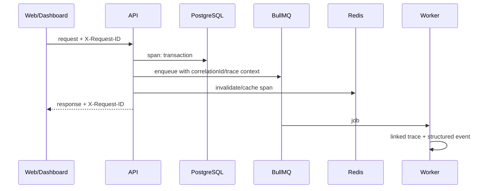

# المراقبة والتشغيل ومعالجة الأخطاء

> **الهدف:** تشغيل MVP قابل للدعم والتحقق من دون تسجيل بيانات حساسة أو التسبب في تسرب بين المستأجرين. تغطي هذه الوثيقة structured logging، correlation، metrics، traces، health checks، أخطاء REST، مراقبة BullMQ، واستجابات الحوادث.

## 1. مبادئ التشغيل

تعامل المراقبة كجزء من التصميم، لا كإضافة بعد إطلاق الميزات. كل طلب HTTP، job، وside effect يجب أن يحمل معرف ترابط يمكن استعماله من الواجهة إلى API إلى Worker. تسجل الأحداث بصيغة JSON منظمة مع سياق محدود، ويمنع تسجيل secrets وOTP وaccess/refresh tokens وأجسام الاستيراد والصور وأرقام الجوال الكاملة.

| المبدأ | التطبيق |
|---|---|
| قابلية التتبع | `correlationId` لكل request، و`traceId/spanId` عند توفر tracing، وتمريرهما في queue jobs. |
| سياق tenant آمن | `tenantId` في logs الداخلية عند وجوده، لا في رسائل المستخدم أو public responses. |
| أقل بيانات | IDs وreason codes وcounts؛ PII مقنع/مجزأ عند الحاجة التشغيلية. |
| قابلة للبحث | schema ثابت للـlogs وحدث تسمية موحد. |
| قابلة للقياس | metrics منخفضة cardinality؛ لا تستخدم userId/vehicleId/tenantId كlabels. |
| آمنة عند الفشل | error response موحد؛ تفاصيل stack في logs المقيدة فقط. |

## 2. نموذج السجل المنظم

```json
{
  "timestamp": "ISO-8601 UTC",
  "level": "info|warn|error",
  "service": "api|worker|web|tenant-dashboard|admin",
  "environment": "local|test|staging|production",
  "event": "inventory.vehicle_sold",
  "correlationId": "...",
  "traceId": "...",
  "requestId": "...",
  "actorType": "staff|customer|admin|system|anonymous",
  "actorId": "...",
  "tenantId": "...",
  "resourceType": "vehicle",
  "resourceId": "...",
  "outcome": "success|failure|denied",
  "reasonCode": "...",
  "durationMs": 0
}
```

الحقول اختيارية بحسب الحدث، لكن `event`, `service`, `environment`, و`correlationId` إلزامية عند إمكانها. لا يسجل التطبيق raw request/response body افتراضيًا. في التطوير، يطبق masking كما في الإنتاج حتى لا تصبح logs مصدر عادات غير آمنة.

| مسموح في logs | محظور في logs |
|---|---|
| UUIDs الداخلية، status، error code، مدة، HTTP method/path المطبّع، count | password، OTP، token، cookie، authorization header، secret، full phone، CSV row، image bytes، full address إن لم يلزم. |
| tenant ID في backend logs المقيدة | tenant data ضمن message للمستخدم أو metric label. |
| file/import ID وchecksum مخفف عند الحاجة | storage presigned URL أو credential أو key حساس. |
| سبب فشل مصنف | stack trace أو SQL raw في API response. |

## 3. Correlation وTracing

يقبل API رأس `X-Request-ID` من allow-list عند مطابقته صيغة آمنة أو ينشئ ID جديدًا، ويعيده في response. ينشئ tracer span للـHTTP request وللاستعلامات الخارجية المهمة (database, Redis, S3, provider)، ويمرر `correlationId`, `traceparent` أو metadata إلى BullMQ job. عند معالجة job، يبدأ worker trace/span جديدًا يربط بالأصل بدلاً من فقدان السياق.



لا تكون attributes الـtrace حاوية لـPII أو OTP أو query values الحساسة. تستخدم sampling مدروسة؛ يحتفظ بالأخطاء والعمليات البطيئة بنسبة أعلى ويطبق redaction قبل التصدير.

## 4. Metrics

تسجل metrics counters/histograms/gauges بمفاتيح قليلة cardinality. تصمم labels مثل `route`, `method`, `status_code_class`, `module`, `queue`, `job_type`, `outcome`, `environment`، ولا تصمم labels مثل `userId`, `vehicleId`, phone، raw URL، أو tenantId.

| الفئة | أمثلة metrics | استخدام تشغيلي |
|---|---|---|
| HTTP | request count، duration p50/p95/p99، 4xx/5xx، rate-limit rejects | SLO للـAPI وتحليل endpoints. |
| Database | pool utilization، query duration، deadlocks/errors، slow query count | connection/tuning/capacity. |
| Redis | latency، eviction، memory، cache hit/miss، rate-limit outcomes | cache/queue health. |
| Queue | depth، oldest age، processing duration، retry/failure/DLQ count | تأخر imports/availability/notifications. |
| Auth | OTP requests/verifications/failures، login failures، refresh reuse | abuse/mزود SMS/security. |
| Search | latency، result count buckets، cache hit، DB scan warning | mobile/search SLO. |
| Storage | upload/finalize/scan reject، bytes buckets، processing time | حماية الملفات وتجربة المستخدم. |
| Business health | active listings، availability overdue، sold visibility lag، lead create success | مراقبة قبول MVP دون إدخال PII. |

## 5. Health checks وReadiness

توفر الخدمة مسارات منفصلة، لا تعيد credentials أو connection strings أو stack traces. يحمي التشغيل الوصول الخارجي لها حسب بيئة النشر؛ لا يجعل `/health/ready` نقطة تعداد للبنية التحتية العامة.

| المسار | المعنى | ما يفحص | النتيجة عند الفشل |
|---|---|---|---|
| `/health/live` | العملية حية ويمكن orchestration إعادة تشغيلها | event loop/process فقط | restart للـinstance عند عدم الاستجابة. |
| `/health/ready` | instance قادر على استقبال traffic | DB connectivity/pool، Redis إن كان شرطًا للوظيفة الأساسية، config validated | يخرج من load balancer. |
| `/health/worker` | worker قادر على استلام jobs | Redis queue connectivity وconfig اللازم | لا يوقف API بالضرورة؛ ينبه ويمنع فقد jobs. |
| `/health/version` اختياري داخلي | build/commit/schema metadata مخفف | لا أسرار | دعم release/debug. |

لا يعمل readiness check باستعلامات ثقيلة أو يستهلك queue. يفرق بين dependency اللازمة للـAPI وبين المزود الاختياري: مثلاً توقف SMS provider يجب أن يفشل OTP endpoint مع error مصنف، لا أن يجعل public vehicle browse غير جاهز تلقائيًا.

## 6. معالجة أخطاء REST

يستعمل global exception filter يحول الأخطاء المتوقعة وغير المتوقعة إلى contract ثابت، ويكتب التفاصيل التقنية في logs مع correlation ID. تتلقى الواجهة رسالة قابلة للعرض بالعربية أو code قابل للترجمة، لا trace أو SQL.

```json
{
  "error": {
    "code": "VEHICLE_NOT_AVAILABLE",
    "message": "تعذر إتمام العملية على السيارة بالحالة الحالية.",
    "details": [{"field": "status", "code": "INVALID_TRANSITION"}],
    "correlationId": "..."
  }
}
```

| الفئة | HTTP | مثال | معالجة العميل |
|---|---:|---|---|
| Validation | 400/422 | نطاق سعر غير صالح | تصحيح الحقل دون تفاصيل داخلية. |
| Authentication | 401 | session منتهية | refresh/login وفق تدفق آمن. |
| Authorization | 403 أو 404 policy | permission/scope غير كاف | لا يكشف ملكية مورد آخر. |
| Not found | 404 | public vehicle غير مؤهل أو غير موجود | صفحة/رسالة عامة. |
| Conflict | 409 | duplicate stock number أو state race | إعادة تحميل/تصحيح مع idempotency. |
| Rate limited | 429 | OTP/login/upload | `Retry-After` وUX متحكم. |
| Dependency unavailable | 503 | Redis/SMS/S3 غير متاح حسب endpoint | retry محدود ورسالة عامة. |
| Unexpected | 500 | exception غير متوقعة | correlation ID وalert، لا stack للعميل. |

تحافظ الأخطاء على code ثابت versioned، ولا تستخدم `500` لأخطاء domain المتوقعة أو `200` لفشل command. تتحقق أخطاء validation قبل jobs وstorage calls لتقليل أعمال غير لازمة.

## 7. موثوقية الأعمال غير المتزامنة

تستخدم BullMQ queues مصنفة مثل `imports`, `media`, `availability`, `notifications`, `cache`. تضبط كل queue concurrency وtimeout/retry/backoff وdead-letter/failure review بما يلائم العمل. لا تضع side effects الخارجية داخل HTTP transaction. يستخدم outbox pattern لضمان إنتاج job/event بعد commit وعدم ضياعه عند فشل العملية بين DB وRedis.

| نوع job | idempotency key | retry | مؤشر تنبيه |
|---|---|---|---|
| availability transition | vehicle ID + transition version | محدود؛ يعيد فحص state | overdue age/failure > threshold. |
| import parsing/commit | import ID + revision | محدود مع failed report | queue age أو failed imports. |
| media processing | asset ID + variant version | retry عابر؛ quarantine عند format failure | reject/failure spike. |
| notification | event ID + channel | exponential؛ لا يعيد إرسال من دون idempotency | provider error/failure rate. |
| cache invalidation | visibility/event ID | retry؛ TTL safety net | stale reconciliation mismatch. |

تسجل dashboards queue depth وأقدم job وretry/failure. إذا توقف worker، تظل transaction الأصلية صحيحة؛ تظهر الحالة `pending` أو `processing` ولا يدعي النظام إتمام import أو إعلام المستخدم من دون نتيجة.

## 8. التنبيهات والاستجابة للحوادث

تحدد التنبيهات بمستويات عمل قابلة للتنفيذ لا لمجرد الضجيج. كل alert يربط runbook: ماذا يعني، ما نطاق التأثير، كيف يثبت، وما خطوات mitigation/rollback/تصعيد.

| الشدة | أمثلة إشارة | الاستجابة الأولية |
|---|---|---|
| Critical | API 5xx مستمر، DB unavailable، auth breach/reuse spike، queue متوقفة تسبب عدم إخفاء sold | incident، حماية/إيقاف عمل حساس، فحص correlation/traces، تواصل تشغيلي. |
| High | p95 search/API يتجاوز SLO، Redis memory/eviction خطير، OTP provider failures | scale/tune أو تعطيل endpoint المتأثر بلطف. |
| Medium | import failures أعلى من baseline، availability job lag، storage rejects مرتفعة | تحليل deployment/config/input، إصلاح worker queue. |
| Low | cache hit ينخفض، slow query trend، capacity approaching | backlog تحسين/فهرس/سعة. |

تحتاج الحوادث المرتبطة بإمكان تسرب tenant إلى playbook خاص: إيقاف endpoint/credential عند الضرورة، حفظ أدلة logs/traces دون PII غير لازم، تحديد نطاق tenant/resource، عدم الادعاء بالإصلاح قبل التحقق، وإجراء post-incident مع regression test.

## 9. أمن المراقبة والاحتفاظ

يفصل الوصول إلى منصة logs/metrics/traces عن صلاحيات التطبيق، ويطبق least privilege وMFA وسياسة retention. يحتفظ AuditLog التجاري وفق متطلبات المنتج والامتثال، ويختلف عن debug logs التي تكون أقصر عمرًا. يضبط redaction في SDK/collector وليس فقط في call sites، وتختبر عملية منع secrets في logs ضمن CI أو اختبارات integration.

| بيانات | سياسة مبدئية |
|---|---|
| Audit للأفعال الحساسة | append-only، وصول مقيد، retention موثق قانونيًا/تشغيليًا. |
| Application logs | JSON redacted، retention قصيرة متناسبة مع الدعم. |
| Traces | sampling/redaction، retention محدودة، لا PII/raw payload. |
| Metrics | aggregates بلا PII، retention أطول للاتجاهات. |
| Error reports | correlation + stack server-side scrubbed، لا request body افتراضيًا. |

## 10. مؤشرات التوسع وSLOs

تحدد SLOs الرقمية قبل الإطلاق بناء على Pilot حقيقي وقدرات البنية؛ لا تقترح هذه الوثيقة أرقامًا مصطنعة. لكن يجب أن يشمل dashboard على الأقل توافر public browse، latency للبحث وصفحة السيارة، نجاح إنشاء Lead بعد OTP، latency/failure للـtenant operations، حداثة availability jobs، وقابلية worker import/media. عند تجاوزها، يبدأ التحقيق بقياس bottleneck (API/DB/Redis/storage/provider) ثم horizontal scaling أو query/index/cache tuning قبل تقسيم الخدمة إلى microservices، وهو خارج MVP.

## 11. اختبارات تشغيلية

| الاختبار | النجاح المطلوب |
|---|---|
| Request correlation | request ID يمر API→DB trace→job→worker ويعاد للعميل. |
| Redaction | لا يظهر OTP/token/password/phone/raw CSV في logs/traces/errors. |
| Error contract | أخطاء validation/auth/domain/dependency تتبع envelope وHTTP صحيحين. |
| Readiness degradation | تعطل dependency يؤثر endpoint الصحيح ولا يعلن API healthy زائفًا. |
| Job retry | فشل عابر يعاد آمنًا، وفشل دائم ينتهي بحالة قابلة للتشغيل والتنبيه. |
| Outbox | حدث بعد commit لا يضيع أو يتضاعف تجاريًا مع retry. |
| Alert drill | alert حرج يقود إلى runbook وcorrelation evidence مفيدين. |

## المراجع

[1]: ../PRD_MVP_Automotive_Marketplace_SaaS_Saudi_v1.0.docx "PRD — MVP: منصة موحدة لمعارض السيارات السعودية، Baseline v1.0"
[2]: ../SRS_MVP_Automotive_Marketplace_SaaS_Saudi_v1.0.docx "SRS — MVP: منصة موحدة لمعارض السيارات السعودية، Baseline v1.0"

تغطي [1] و[2] health checks، structured logging، correlation ID، rate limiting، منع تسجيل الأسرار والـOTP، queue safety، اختبارات العزل، والتشغيل الملائم للـMVP. يجب تصحيح روابط المصدر النسبية عند إدخال الوثائق إلى المستودع الفعلي.
