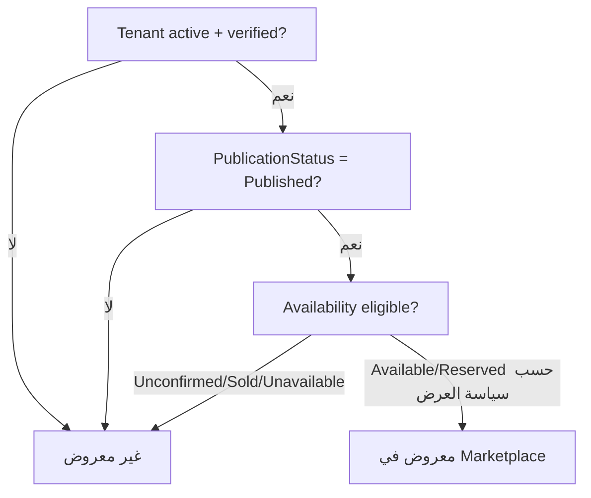

# معمارية البحث والسوق العام

> **القرار:** يستخدم الـMVP PostgreSQL كمصدر البحث والفلاتر، مع REST query contract وcursor pagination وفهارس يقودها نمط الاستعلام الحقيقي. لا يعتمد MVP OpenSearch/Elasticsearch. يكون منطق أهلية الظهور مركزيًا في الـAPI ولا ينفذ في الواجهة أو في cache فقط.

## 1. نطاق البحث

يعرض السوق العام سيارات معارض متعددة في نتيجة واحدة بشرط أن تكون السيارة والمنشأة مؤهلتين للنشر. يدعم العقد البحث/الفلاتر المطلوبة: المدينة، جديدة/مستعملة، الماركة، الموديل، السعر، السنة، الممشى، ناقل الحركة، الوقود، ونوع الهيكل، مع فرز الأحدث والسعر والممشى وآخر تأكيد للتوفر. لا يعيد البحث أي بيانات تشغيلية داخلية للمستأجر.

| القرار | تطبيقه |
|---|---|
| مصدر الموقع | `Vehicle.branch_id → Branch.city_id`، وليس City مفترضة للـTenant. |
| مصدر الأهلية | `Tenant status + verification + Vehicle publication + availability policy` من server-side query/policy. |
| مصدر السمات | Catalog عالمي للـBrand/Model والخصائص؛ لا نسخ tenant-local. |
| هوية عامة | `publicId`/slug عالي العشوائية، لا primary key متسلسل. |
| pagination | cursor مستقر قائم على sort fields + ID tie-breaker؛ لا offset واسع للقوائم العامة. |
| DTO | `PublicVehicleCardDTO` و`PublicVehicleDetailDTO` منفصلان عن Entity/Prisma model. |

## 2. سياسة أهلية الظهور

يُعرّف `PublicVehicleEligibilityPolicy` مرة واحدة ويعاد استعماله في list، detail، dealer page، وcache invalidation. يمنع ذلك اختلافًا مثل ظهور سيارة في صفحة المعرض واختفائها من نتيجة البحث بلا سبب تجاري واضح.



يوصى بأن تكون `Reserved` قابلة للعرض بوسم واضح فقط إن أكد مالك المنتج ذلك؛ أما `Sold`, `Unavailable`, `AvailabilityUnconfirmed` بعد المهلة، و`Draft/Archived/Suspended` فلا تظهر. القرار النهائي لظهور `Reserved` يوثق كـbusiness policy قبل التنفيذ ولا يترك لتصرف الواجهة. عند `MarkSold` أو تعليق Tenant يجب أن تختفي السيارة فورًا منطقيًا من أي query حتى لو تأخرت إزالة cache؛ لذا يتحقق query نفسه من الأهلية.

| المغير | النتيجة اللازمة |
|---|---|
| بيع سيارة | استبعاد فوري من queries العامة، إبطال cache، منع Leads جديدة، Audit. |
| انتهاء مهلة التوفر | job يغير الحالة وفق policy، ثم إبطال/تحديث read cache. |
| إعادة تأكيد التوفر | يعيد eligibility وفق publication/status، ويحدّث timestamp للفرز. |
| نشر/تعليق/أرشفة | يغير ظهور السيارة ومؤشرات المعرض. |
| تعليق/رفض Tenant | يستبعد جميع سياراته العامة عبر tenant predicate؛ invalidate keys ذات الصلة. |
| تعديل city/branch | يعيد تموضع المركبة في city filter ويحدث caches. |

## 3. عقد REST المقترح

```text
GET /public/vehicles
  ?cityId=
  &condition=new|used
  &brandId=
  &modelId=
  &minPrice=&maxPrice=
  &minYear=&maxYear=
  &minMileage=&maxMileage=
  &transmission=
  &fuelType=
  &bodyType=
  &sort=newest|price_asc|price_desc|mileage_asc|availability_confirmed_desc
  &cursor=
  &limit=
```

تُعرّف Zod/DTO validation حدود القيمة، أنواع UUID/enums، علاقات model إلى brand، وأقصى limit. ترفض الخدمة فلاتر غير متسقة (مثل `minPrice > maxPrice`) بدل تجاهلها بصمت. تملك الاستجابة envelope ثابتًا: `data`, `pageInfo.nextCursor`, و`appliedFilters` مع request/correlation ID عند أسلوب API العام. لا يعرض query raw SQL أو internal tenant IDs أو production debug data.

| sort | ترتيب مستقر | cursor components |
|---|---|---|
| `newest` | `published_at DESC, id DESC` أو `created_at` حسب تعريف المنتج | timestamp + public ID. |
| `price_asc/desc` | `price`, ثم `id` | decimal price + public ID. |
| `mileage_asc` | `mileage ASC NULLS LAST, id` | mileage + public ID. |
| `availability_confirmed_desc` | `last_availability_confirmed_at DESC, id` | timestamp + public ID. |

يوقّع cursor أو يشفّر في base64 URL-safe بنية versioned ويُتحقق منه مقابل sort/filter hash؛ لا يقبل معايير cursor مقدمة بحرية أو text SQL.

## 4. طبقة القراءة والاستعلام

تنفذ وحدة `search` query service مخصصة بدلاً من تسريب repository المخزون. تنضم Vehicle إلى Branch/City وCatalog وTenant public data الضرورية، ثم تحول النتائج إلى public DTO في السيرفر. يمكن أن تبدأ باستعلام SQL/Prisma مضبوط مع select صريح، وتمر مراجعة `EXPLAIN ANALYZE` بعد seed واقعي قبل إضافة فهرس جديد.


لا يعيد الاستعلام حقولًا مثل `tenant_id`, `stock_number`, `internal_notes`, membership data، أو تفاصيل reservation والـaudit. توضع الأسماء العامة للمعرض والفرع والمدينة فقط، ورقم الاتصال/WhatsApp وفق data-minimization والسياسة المعتمدة.

## 5. الفهارس واستراتيجية PostgreSQL

يجب أن تبدأ الفهارس بالقياسات الفعلية وأن تنشأ migrations قابلة للمراجعة. يتوقع استخدام B-tree المركب للـfilters والترتيبات العلائقية، وفهارس partial حيث تدعم شروط الأهلية الثابتة نسبيًا. لا يمكن وضع predicate متغير زمنيًا مثل `next_confirmation_due_at > NOW()` في partial index ثابت بصورة مباشرة؛ لذلك يعالج job الحالة إلى قيمة indexable بدلاً من إساءة استخدام فهرس زمني.

| النمط | فهرس/إجراء مبدئي | ملاحظة |
|---|---|---|
| join city | `branch(city_id, id)` و`vehicle(branch_id)` | لأن city مشتقة من Branch. |
| حالة عامة | فهرس مركب على publication/availability/branch أو partial index للسيارات المؤهلة | يراجع بعد قياس cardinality. |
| price/year/mileage | فهارس وفق أكثر الفلاتر استعمالًا؛ لا تخلق كل التباديل | التوافيق الكثيرة ترفع write cost. |
| latest/confirmation sort | فهرس متوافق مع order وpublic predicate | يختبر مع cursor. |
| brand/model | `vehicle(brand_id, model_id)` أو ترتيب يطابق selectivity | يفرض validation أن model يتبع brand. |
| الصفحات الفردية | unique public ID/slug + eligibility check | لا يعيد lookup داخلي بالـID فقط. |

يمنع N+1 بالـselects/joins التي تشمل الصورة الأساسية وDTO الضروري فقط. تستعمل صور مصغرة/variants من storage ولا يعاد تحميل metadata كاملة لكل card. تضع الخدمة query timeout معقولًا وحد response size وحد limit، وتراقب slow queries.

## 6. Cache strategy للبحث العام

الـcache تحسين أداء وليس مصدر حق أو حارس صلاحية. يُستخدم فقط للقراءات العامة ذات TTL قصير، وتبقى كل query حساسة للأهلية موثوقة من PostgreSQL عند cache miss. ينبغي أن يبنى المفتاح من version، normalized filters، sort، cursor، locale، وpublic policy version. لا تدخل بيانات العميل أو session أو tenant dashboard في cache العام.

| الطبقة | المحتوى | المفتاح | الإبطال |
|---|---|---|---|
| Catalog cache | cities/brands/models النشطة | `public:catalog:{type}:v{version}` | حدث catalog publish/update. |
| Search list cache | صفحة نتيجة عامة | `public:search:v{policy}:{hash(filters+sort+cursor)}` | TTL قصير + tag/index invalidation للأحداث. |
| Vehicle detail cache | DTO عام للسيارة | `public:vehicle:{publicId}:v{visibilityVersion}` | بيع/تعديل نشر/تعديل صور/سعر/availability. |
| Dealership page | profile عام + first inventory page | `public:dealer:{slug}:v{visibilityVersion}` | tenant status/profile/inventory events. |

لأن invalidation المثالي مع جميع filter combinations مكلف، يبقى TTL قصيرًا ويصحح eligibility query/detail على الدوام. تستخدم visibility version أو event-driven tag map بإدارة محدودة؛ لا تُبنى آلية invalidation عامة معقدة قبل قياس الحاجة.

## 7. التوفر والمهام الخلفية المرتبطة بالبحث

تدير `inventory` دورة التأكيد، بينما يقوم worker دوري idempotent بفحص السيارات التي يحين موعد تأكيدها أو تجاوزت مهلة الإخفاء. يقفل/يستدعي الصفوف بحذر لتجنب worker duplication، ويصدر events بعد transaction. لا تجعل صفحات البحث منطقها يعتمد على cron في واجهة Next.js أو على `NOW()` مع سلوك غير قابل للتنبؤ فقط.

| job | الجدولة/المحفز | أثره |
|---|---|---|
| `availability.transition-due` | repeatable BullMQ job أو scheduler موثوق | يحول eligible Vehicle إلى `AvailabilityUnconfirmed`. |
| `availability.hide-expired` | بعد grace period | يبقي السيارة مستبعدة من public policy حتى إعادة تأكيدها. |
| `search.invalidate` | event بعد تغير visibility | يبطل detail/dealer/search tags أو يزيد version. |
| `search.reconcile` | دوري منخفض التواتر | يكتشف projection/cache anomalies دون تغيير غير مبرر. |

يحمل كل job `tenantId`, `vehicleId`, `eventId`, وidempotency key، ويعيد التحقق من حالة record؛ ولا يستعمل worker timestamp قديم كتبرير لطمس تعديل أحدث.

## 8. SEO والأداء الجوال

تستخدم صفحات السيارة والمعرض SSR/ISR وفق برنامج Next.js المقرر، metadata عربية/RTL، canonical URL، وربما structured data بعد مراجعة SEO/قانونية. لا تخزن صفحات خاصة بمستخدم أو Query متغير غير مقيد كـstatic بلا سياسة invalidation. يركز الأداء الجوال على payload DTO صغير، صورة رئيسية responsive، lazy loading، cursor pagination، وتعطيل تحميل filters/reference data غير اللازمة أوليًا.

## 9. قابلية التوسع ومعايير نقل التقنية

لا يضاف محرك بحث مستقل لأن الفلاتر structured وحجم الـPilot متوقع أن يسمح به PostgreSQL مع فهارس صحيحة. يعد OpenSearch/Elasticsearch خيارًا مستقبليًا فقط إذا أظهرت القياسات أن p95 البحث، أو حجم catalog، أو حاجة full-text/geo/relevance لا تتحقق بقاعدة البيانات ضمن SLO موثق.

| إشارة القياس | الاستجابة قبل محرك مستقل | قرار لاحق محتمل |
|---|---|---|
| p95 search مرتفع | EXPLAIN، فهرس، DTO أصغر، cache، limits | read replica أو search index بعد ADR. |
| DB CPU/IO مرتفع | query tuning، pagination، pool، catalog cache | read model/replica. |
| full-text متقدم مطلوب | بحث PostgreSQL محدود/tsvector إن كان ضمن scope | محرك بحث مستقل خارج MVP. |
| geo/ranking معقد | تحليل product/SLO | ADR جديد مع index pipeline. |

## 10. الاختبارات والمراقبة

| الاختبار/المؤشر | المطلوب |
|---|---|
| City filter | يعيد فقط Vehicles التي يقع Branch الخاص بها في City المختارة. |
| Eligibility | لا تظهر Draft/Sold/Unavailable/Archived أو Tenant غير نشط/غير معتمد. |
| Filter composition | لا تتجاوز النتيجة أي شرط المستخدم. |
| Cursor | لا تكرار/تخطي نتيجة عبر الصفحات عند بيانات مستقرة. |
| Public DTO | لا تسرب حقول داخلية tenant أو PII غير لازمة. |
| Availability freshness | البيع/الإخفاء يزيلان النتيجة منطقيًا فورًا وcache سريعًا. |
| Observability | p50/p95/p99، rows scanned، cache hit، DB latency، errors، result count distribution. |

## المراجع

[1]: ../PRD_MVP_Automotive_Marketplace_SaaS_Saudi_v1.0.docx "PRD — MVP: منصة موحدة لمعارض السيارات السعودية، Baseline v1.0"
[2]: ../SRS_MVP_Automotive_Marketplace_SaaS_Saudi_v1.0.docx "SRS — MVP: منصة موحدة لمعارض السيارات السعودية، Baseline v1.0"

تغطي [1] و[2] فلاتر وعمليات الفرز، City عبر Branch، إخفاء السيارة المباعة/غير المؤكدة، pagination، وبيانات DTO العامة. يجب تصحيح روابط المصدر النسبية عند إدخال الوثائق إلى المستودع الفعلي.
