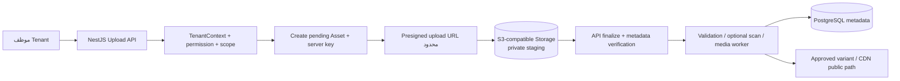
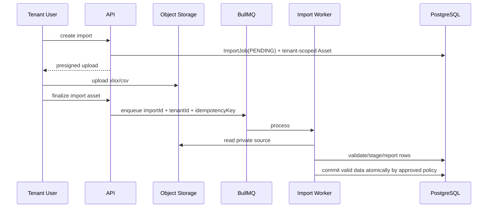

# معمارية التخزين الكائني والملفات

> **القرار:** تحفظ الصور وملفات الاستيراد خارج PostgreSQL في S3-compatible Object Storage. تبقى قاعدة البيانات مصدر الحقيقة للـmetadata والعلاقة التجارية، بينما يتحكم NestJS API في إنشاء المفاتيح ورفع الصلاحيات وتثبيت الأصول. لا يحصل العميل على أي credential دائم للتخزين.

## 1. نطاق التخزين

يدعم التخزين في الـMVP صور المركبات وملفات Excel/CSV الخاصة بالاستيراد. لا تحفظ الملفات الثنائية داخل PostgreSQL ولا يرسل المتصفح الملف عبر عملية business طويلة متزامنة في الـAPI عند توفر presigned upload. تتحقق المنصة من نوع الملف وحجمه وصلاحيته قبل ربطه بVehicle أو تشغيل import، وفق متطلبات SRS.

| فئة الأصل | مالكها | نمط الوصول | مدة الاحتفاظ |
|---|---|---|---|
| صور Vehicle | Tenant/Vehicle | public عبر CDN/object URL مضبوط فقط بعد النشر أو private presigned read | حتى الحذف/الأرشفة وسياسة retention. |
| صور قيد المراجعة | Tenant/Vehicle | private فقط | حتى قبول/رفض التحضير أو انتهاء TTL. |
| مصدر Excel/CSV | Tenant/Import | private فقط، presigned upload/read محدود | TTL واضح بعد اكتمال التقرير؛ لا يعرض للعامة. |
| ناتج import/report أخطاء | Tenant/Import | private لمستخدمي tenant المصرح لهم | TTL/retention تشغيلي موثق. |
| ملفات quarantine | System | لا وصول للمستخدم | تحذف أو تعالج وفق سياسة الأمان. |

## 2. الفصل بين البيانات والملفات

تحتفظ قاعدة البيانات بـ`Asset` أو metadata مخصصة، على الأقل: `id`, `tenant_id`, `owner_type`, `owner_id`, `storage_key`, `content_type`, `size_bytes`, `checksum`, `status`, `created_by`, `created_at`, وخصائص variant. يربط `VehicleImage` بـasset موثق وليس بـURL مدخل من العميل. لا يعد وجود كائن في bucket دليلاً على أنه قابل للعرض أو منتمٍ لمركبة.



## 3. تصميم المفاتيح (Keys) والعزل

ينشئ الخادم جميع المفاتيح ويمنع العميل من تمرير prefix أو `storageKey` النهائي. تضمين tenant في المفتاح ليس بديلاً عن authorization لكنه يوفر فصلًا تشغيليًا واضحًا ويسهل النقل المستقبلي لمستأجر Enterprise.

```text
# صور المركبات
private/tenants/{tenantId}/vehicles/{vehicleId}/assets/{assetId}/original
public/tenants/{tenantId}/vehicles/{vehicleId}/assets/{assetId}/variants/{name}

# الاستيراد
private/tenants/{tenantId}/imports/{importId}/source/{assetId}
private/tenants/{tenantId}/imports/{importId}/reports/{reportId}

# quarantine المؤقت
quarantine/{assetId}
```

| القاعدة | التفسير |
|---|---|
| UUID/UUIDv7 للأصول | يمنع التخمين وسوء استخدام الاسم الأصلي. |
| لا اسم ملف أصلي داخل key | يحتفظ به metadata مخفف عند الحاجة؛ يمنع path traversal وPII في URL. |
| tenantId/owner IDs منشأة من الخادم | لا يثق في body/query لتحديد المسار. |
| bucket/prefix خاص | يمنع list/read/write العشوائي على مستوى IAM/storage policy. |
| `Asset.status` | `PENDING_UPLOAD`, `UPLOADED`, `VALIDATING`, `READY`, `REJECTED`, `QUARANTINED`, `DELETED`. |
| object tags/metadata | تساعد retention/traceability لكن لا تمنح صلاحيات. |

## 4. تدفق رفع صور المركبات

1. يثبت API session الموظف، ثم يحل `TenantContext` ويتحقق من permission الصور ومن Vehicle/Branch scope.
2. ينشئ سجل Asset بحالة `PENDING_UPLOAD` ومفتاحًا محددًا ومدة قصيرة للرفع.
3. يصدر presigned **PUT** لملف واحد مع content-type وحجم/conditions مقيدة قدر دعم المزود.
4. يرفع العميل مباشرة إلى private staging prefix؛ ولا ينتج هذا نشرًا أو ربطًا تجاريًا تلقائيًا.
5. يستدعي العميل `finalize` مع `assetId` فقط. يتحقق API من أن asset في نفس tenant والمالك، ويقرأ HEAD metadata ويتحقق من الحجم والنوع/checksum حيث متاح.
6. يرسل worker للتحقق/توليد variants، ثم ينقل/ينسخ الأصل إلى مسار معتمد أو يعلّم asset `READY`.
7. يسمح `vehicles` بربط asset الجاهز بسيارة وبتعيين `isPrimary` داخل transaction، ويصدر invalidation للـpublic cache إن كانت منشورة.

لا يفترض API أن `Content-Type` الذي أرسله المتصفح صحيح. يتحقق worker من signature/magic bytes وصيغة الصورة وفكها الآمن والحدود البعدية قبل العرض. تحدد قائمة MIME مسموحة للصور، وحد أعلى للحجم والأبعاد والعدد لكل Vehicle عبر config/plan policy. يجب تعطيل SVG أو معاملته بسياسة خاصة لأن عرضه قد يحمل محتوى نشطًا.

## 5. النشر والوصول إلى الصور

الصور قبل الاعتماد private. بعد أن تصبح الصورة مرتبطة بمركبة مؤهلة للنشر، تُخدم variant من CDN أو object URL عام مقيّد بمسار public لا يكشف الأصل أو ملفات imports. إذا تغيرت eligibility إلى Sold/Archived/Suspended، يمكن إبقاء صورة cache لفترة محدودة إن كانت URL عامة؛ لكن صفحة/DTO السيارة لا تشير إليها. إذا تطلبت سياسة الأعمال إزالة الأصل فورًا، يصدر event حذف/invalidations. لا ينبغي أن يستخدم bucket public قراءة واسعة لمسارات `private/`.

| نوع الوصول | الميكانيكية |
|---|---|
| Marketplace public | URL لvariant approved فقط، path غير قابل للتخمين كطبقة مساعدة، وCDN/object policy للـpublic prefix فقط. |
| Tenant Dashboard | API authorization ثم presigned GET قصير لصور/ملفات غير عامة، أو signed CDN URL. |
| Admin | PlatformAdminContext + سبب عند عرض أصول خاصة/Quarantine + Audit. |
| Worker | IAM/service credential بأقل صلاحيات prefixes اللازمة. |
| Backend | IAM role/server credentials؛ لا secrets في frontend. |

## 6. استيراد Excel/CSV

يُعامل ملف الاستيراد كأصل خاص عالي الحساسية لأنه قد يحتوي بيانات مخزون أو أرقامًا. يمر من upload إلى `ImportJob` منفصل ثم queue. لا ينفذ parsing على request thread أو يحدّث Vehicle live صفًا صفًا بلا staging/report. يحفظ تقرير أخطاء قابلًا للعرض للمستأجر المعني فقط، ولا يسجل صفوف الملف raw في application logs.



## 7. ضوابط أمن الملفات

| الخطر | التحكم المعماري |
|---|---|
| رفع ملف تنفيذي أو MIME مزيف | allow-list، magic-byte inspection، رفض غير المطابق، وquarantine. |
| صورة عملاقة/decompression bomb | حد bytes وأبعاد ووقت معالجة، worker isolation، ورفض آمن. |
| ملف import ضخم | limit حجم/صفوف، streaming parser، time/memory ceiling، queue concurrency. |
| قراءة ملف Tenant آخر | Asset repository scoped بـTenantContext، prefixes server-generated، presigned URL قصير. |
| overwrite لمسار قائم | assetId/key فريد؛ presigned conditions؛ no client-chosen key. |
| تسريب URL دائم | private URL ليس public؛ presigned GET قصير؛ لا URL في logs. |
| malware | فحص/adapter مكافحة برمجيات خبيثة قبل `READY` حيث تتطلب سياسة التشغيل، مع fail-closed لملفات مشبوهة. |
| object orphan | lifecycle rule وreconciliation job يحذف PENDING المنتهية وunreferenced objects بعناية. |

## 8. workers والموثوقية

تعمل media/import processors من codebase ذاته على BullMQ. يحمل job `assetId/importId`, `tenantId`, version، وidempotency key؛ يعيد resolver التحقق من tenant/asset status قبل القراءة أو الكتابة. تضبط retries بنمط exponential backoff وعدد أقصى وdead-letter workflow أو failed status قابل للمراجعة. لا تضع bytes الملف داخل Redis payload؛ يمر المرجع/المفتاح فقط.

تخزن قياسات مثل وقت upload/finalize/processing، reject reasons مصنفة، queue age، failure/retry counts، وحجم object. لا تسجل filename الأصلي أو headers الحساسة أو محتوى الملف في logs؛ وإذا احتاج فريق الدعم مرجعًا، يستخدم asset/import ID وcorrelation ID.

## 9. lifecycle والنسخ الاحتياطي

تحدد سياسات lifecycle في مزود التخزين لحذف `PENDING_UPLOAD` غير المكتملة، والـquarantine وفق مدة أمنية، وملفات imports المصدرية بعد retention معتمد. أما صور المركبات المرجعية فلا تحذف تلقائيًا قبل transaction يحذف/يفك المرجع ويضمن عدم استعمالها في DTO عام. يتضمن recovery runbook مطابقة asset metadata مع objects، وإعادة إنشاء variants، واسترجاع object version عند توفر versioning. يعد versioning/encryption at rest وbucket logging خيارات تشغيلية موصى بها وتوثق بحسب المزود.

## 10. الاستعداد لفصل قاعدة Tenant

لأن keys تحتوي `tenantId` وasset metadata مستقلة عن database connection، يمكن نقل Tenant Enterprise إلى قاعدة مخصصة مع إبقاء assets في bucket مشترك مبدئيًا أو نسخ prefix كامل لاحقًا. تقرر `TenantDataSourceResolver` مصدر metadata، بينما تبقى `StorageKeyFactory` مستقلة عن مصدر البيانات. لا تعتمد business rules على bucket منفصل لكل tenant في الـMVP.

## 11. اختبارات قبول التخزين

| المعرف | التحقق |
|---|---|
| TC-STO-001 | Tenant A لا يستطيع finalize/read Asset لـTenant B. |
| TC-STO-002 | key مقدّم من العميل أو prefix مخالف يرفض. |
| TC-STO-003 | ملف يتجاوز النوع/الحجم/الأبعاد يرفض ولا يرتبط بـVehicle. |
| TC-STO-004 | Asset غير مكتمل أو غير `READY` لا يصبح صورة رئيسية أو عامة. |
| TC-STO-005 | Import غير صالح يولد report ولا يفسد البيانات الحية. |
| TC-STO-006 | إعادة job لملف/asset لا تكرر variant أو import commit. |
| TC-STO-007 | لا تظهر private object URLs أو file content في logs/errors. |

## المراجع

[1]: ../PRD_MVP_Automotive_Marketplace_SaaS_Saudi_v1.0.docx "PRD — MVP: منصة موحدة لمعارض السيارات السعودية، Baseline v1.0"
[2]: ../SRS_MVP_Automotive_Marketplace_SaaS_Saudi_v1.0.docx "SRS — MVP: منصة موحدة لمعارض السيارات السعودية، Baseline v1.0"

تستند [1] و[2] إلى متطلبات صور المركبات، تحديد الصورة الرئيسية، Excel/CSV، والتحقق من نوع/حجم الملفات وعزل ملفات Tenant. يجب تصحيح روابط المصدر النسبية عند إدخال الوثائق إلى المستودع الفعلي.
