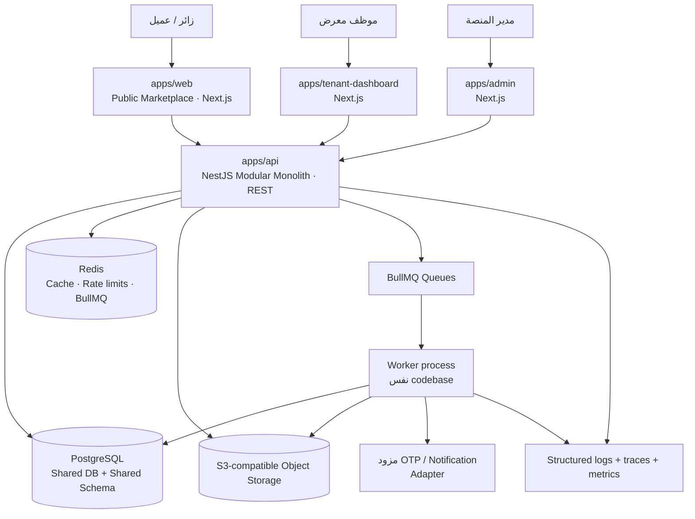

# معمارية النظام المستهدفة — MVP

> **الحالة:** مراجعة معمارية تصميمية فقط. لا تتضمن هذه الوثيقة أي تنفيذ برمجي أو حكمًا على جودة كود قائم، لأن المستودع وتقارير تحليل الحالة المطلوبة لم تكن متاحة وقت المراجعة. تستند القرارات إلى PRD وSRS، وهما مرجع النطاق المعتمد.

## 1. القرار المعماري التنفيذي

يعتمد الـMVP **Modular Monolith** داخل **Monorepo**. تتشارك التطبيقات واجهات العقود والأنواع والتحقق والمكوّنات المرئية، بينما تنفّذ خدمة NestJS واحدة منطق الأعمال والوصول إلى PostgreSQL وRedis والطوابير والتخزين الكائني. هذا يمنح المنتج حدودًا منطقية واضحة وقابلية اختبار ونشر مستقلة للواجهات، من دون كلفة تشغيلية أو تعقيد اتصالات الشبكة بين خدمات صغيرة لا يبررها نطاق الـPilot.

يعتمد النظام قاعدة **PostgreSQL مشتركة ومخططًا مشتركًا وعمود `tenant_id`** لكل بيانات المعارض. لا يسمح هذا القرار باعتبار `tenant_id` القادم من العميل مصدر ثقة؛ بل يشتق سياق المستأجر من هوية الموظف وعضويته الفعالة في المعرض. يؤمّن هذا العزل على طبقات API والتطبيق والبيانات، مع طبقة RLS اختيارية دفاعية للبيانات الحساسة.

| المجال | القرار | السبب ضمن الـMVP |
|---|---|---|
| تنظيم الكود | Monorepo بـ `pnpm` وTurborepo | مشاركة متحكم بها للعقود والتحقق وواجهة المستخدم والإعدادات. |
| الواجهات | Next.js/TypeScript | متجر عام سريع قابل للفهرسة، ولوحات داخلية منفصلة التجربة والصلاحيات. |
| الخدمة الخلفية | NestJS/REST API | وحدات واضحة، DI، حراس أمن، OpenAPI، وعمليات قابلة للاختبار. |
| البيانات | PostgreSQL + Prisma | معاملات علائقية قوية لمخزون/Leads وعلاقات tenant/branch/vehicle. |
| الوسيط | Redis | cache، rate limiting، جلسات/رموز قصيرة العمر، وBullMQ. |
| الأعمال غير المتزامنة | BullMQ فوق Redis | imports، إخفاء المخزون المنتهي، معالجة الملفات، وإشعارات قابلة لإعادة المحاولة. |
| الملفات | S3-compatible Object Storage | صور سيارات وملفات استيراد خارج قاعدة البيانات، مع مسارات مقيدة بالمستأجر. |
| البحث | PostgreSQL أولًا | الفلاتر المنظمة مطلوبة في الـMVP ولا تتطلب محرك بحث منفصلًا. |

## 2. الرسم العام للنظام



الـAPI هو **نقطة الإنفاذ الوحيدة** للبيانات المحمية. لا تتصل تطبيقات Next.js بقاعدة البيانات أو Redis أو مساحة التخزين مباشرة. أما الاستثناء المقيّد فهو رفع الملفات عبر **presigned URL** تصدره الـAPI بعد التحقق من الهوية والصلاحية والـTenantContext، ثم يلزم استدعاء API لتثبيت الملف والتحقق منه قبل ربطه بكيان سيارة.

## 3. طوبولوجيا التطبيقات داخل الـMonorepo

```text
apps/
  web/                  # السوق العام، عربي/RTL، صفحات SEO، لا يحمل صلاحيات موظفين
  tenant-dashboard/     # لوحة المعرض المقيدة بـTenantContext
  admin/                # إدارة المنصة المقيدة بدور Platform Admin
  api/                  # NestJS API وعمليات BullMQ worker من الكود نفسه
packages/
  ui/                   # مكوّنات عرض مشتركة خالية من منطق الأعمال
  contracts/            # DTOs/OpenAPI client contracts وpagination/envelopes
  validation/           # Zod schemas مشتركة وحدود المدخلات
  types/                # أنواع مشتركة غير تجارية أو generated-safe types
  auth/                 # client auth utilities وclaims types؛ لا أسرار
  database/             # Prisma schema، migrations، repositories، seed
  config/               # typed environment schema والإعدادات المشتركة
  eslint-config/        # قواعد lint المركزية
  tsconfig/             # إعدادات TypeScript المركزية
```

يجوز فصل تشغيل الـAPI والـWorker إلى عمليتين منشورتين بصورة مستقلة من نفس التطبيق والكود؛ لا يعد ذلك Microservices لأنهما يملكان نفس حدود المجال ونفس العقود الداخلية وقاعدة النشر المنطقي. يفيد الفصل في حماية زمن استجابة طلبات HTTP من أعمال الاستيراد والمعالجة الثقيلة.

| التطبيق | المسؤولية المسموحة | مسؤوليات محظورة |
|---|---|---|
| `web` | عرض السوق، صفحات سيارة/معرض، SEO، بدء OTP، طلب عرض سعر، مفضلة العميل | استيراد Prisma، افتراض Tenant داخلي، إظهار DTO داخلي، فرض صلاحيات موظف في الواجهة فقط. |
| `tenant-dashboard` | UX المخزون وLeads والموظفين والفرع، استهلاك API tenant | إرسال `tenantId` على أنه مصدر سلطة، منطق انتقال الحالات، وصول مباشر للتخزين. |
| `admin` | UX اعتماد المعارض والكتالوج والجودة والخطط والمؤشرات | إعادة استعمال routes موظفي Tenant، تعديل بيانات tenant دون صلاحية server-side. |
| `api` | مصادقة وتفويض، وحدات المجال، REST، repository، jobs producers | خلط DTOs العامة والداخلية، اعتماد عابر للوحدات على Prisma client مباشرة. |

## 4. طبقات التنفيذ داخل NestJS

كل وحدة NestJS تتبع تدرجًا متسقًا، وتتواصل خارجيًا عبر **public application port** وليس عبر جداول أو services خاصة بوحدة أخرى.

```text
transport/       Controllers · guards · interceptors · request DTO adapters
application/     Use cases · command/query handlers · transactions · policies
 domain/          Entities/value objects · state transitions · domain events
 infrastructure/ Prisma repositories · S3/Redis/BullMQ/adapters · providers
```

الـController يتولى التحويل بين HTTP وDTO فقط. الـUse Case ينسق قواعد الأعمال داخل Transaction Boundary ويطلب `TenantContext` صريحًا حيث يلزم. الـRepository هو المكان الوحيد لاستدعاءات Prisma الخاصة بموارد Tenant؛ لا تملك React components أو controllers أو services في وحدات أخرى حق استخدام الـPrisma model مباشرة.

## 5. تطبيقات التجربة

### 5.1 Public Marketplace

تُبنى واجهة السوق بمزيج Server Components/SSR أو ISR للصفحات العامة، مع client state محدود للفلاتر التفاعلية. مسار البحث يمر إلى endpoint عام يقدم **PublicVehicleSearchDTO** محدود الحقول. تكون نتيجة العرض محكومة دائمًا بسياسة publication + availability + tenant status في الخدمة الخلفية؛ لا تعتبر إخفاءات الواجهة الضمان الأمني.

تستخدم الصفحات العامة slugs أو public IDs عالية العشوائية بدلاً من مفاتيح متسلسلة قابلة للتخمين. صفحة السيارة لا تعيد ملاحظات الموظفين أو بيانات الأعضاء أو حالات داخلية. أفعال الاتصال وWhatsApp تسجل كأحداث analytics عبر API أو queue ولا تنشئ Lead دون تدفق OTP المقرر.

### 5.2 Tenant Dashboard

تتعامل لوحة المعرض مع session موظف، ثم تستدعي endpoints من مساحة `/tenant/*`. تستنتج الخدمة الخلفية `TenantContext` من الجلسة والعضوية المختارة المسموح بها، وتعيد فقط ما يقع ضمن scope الفروع. تعرض الواجهة مؤشرات "ما يحتاج انتباهًا" ولكن الاحتساب يأتي من query services محكومة بالسياق لا من حمولات شاملة للمخزون أو الـLeads.

### 5.3 Admin

لوحة الإدارة مساحة منفصلة للمشرفين على المنصة. لا يحمل `PlatformAdminContext` مستأجرًا افتراضيًا، وتكون كل عملية عبور إلى بيانات مستأجر معلنة بسجل Audit إلزامي. لا يعيد الـAdmin API استعمال guards الموظفين ولا يلتف حول عزل tenant؛ بل يستخدم capability مخصصة قليلة الامتياز مع سبب اختياري عند العمليات الحساسة.

## 6. قواعد الاعتماد الرئيسية

| القاعدة | التفسير |
|---|---|
| اعتماد طبقي باتجاه الداخل | `transport → application → domain`؛ وتنفذ البنية التحتية interfaces يحددها التطبيق/المجال. |
| لا اعتماد مباشر بين وحدات المجال | تتكامل الوحدات عبر ports أو domain/integration events أو read models محددة. |
| لا Prisma خارج package database/repositories | يحول ذلك دون استعلامات غير مقيّدة أو جعل schema عقدًا عامًا. |
| لا DTO داخلي في REST public | كل مساحة API تملك DTOs صريحة ومخصصة للغرض. |
| لا منطق أعمال في Next.js | الواجهة تتحقق UX فقط؛ التحقق والتفويض وانتقالات الحالة authoritative في API. |
| لا اعتماد `catalog` على tenant modules | Catalog عالمي؛ vehicle/reference modules تعتمد عليه في اتجاه واحد. |
| لا اعتماد `audit` أو `analytics` على تفاصيل المجال | تستهلك أحداثًا بعقد ثابت؛ لا تتحكم في المعاملة الأصلية إلا حيث يكون audit متزامنًا مطلوبًا. |
| لا cycles بين packages | يمنعها lint/graph checks؛ يعاد تعريف contract أو port عند ظهور دورة. |

## 7. واجهة REST وأنماط النقل

تُنظم endpoints ضمن مساحات `public`, `auth`, `tenant`, و`admin`. تستعمل pagination cursor-based لقوائم السيارات وLeads، وrequest IDs/Correlation IDs في كل response. يعيد الخطأ envelope موحدًا لا يكشف SQL أو stack trace أو هوية tenant آخر. تحدد عملية تغيير حالة المخزون command صريحًا (مثل `mark-sold` أو `confirm-availability`) بدلاً من PATCH حر يتجاوز آلة الحالات.

| مساحة API | هوية مطلوبة | النطاق |
|---|---|---|
| `/public/*` | لا؛ OTP عند الأفعال الحساسة | سيارات ومعارض منشورة فقط وDTO عام. |
| `/auth/*` | حسب التدفق | OTP، login موظف، refresh، logout وإدارة session. |
| `/tenant/*` | session موظف | TenantContext + role/permission + branch scope. |
| `/admin/*` | session Platform Admin | قدرة إدارية صريحة + Audit للعمليات الحساسة. |
| `/health/*` | شبكة تشغيلية فقط أو مفتاح داخلي | liveness/readiness لا يكشف أسرارًا أو تفاصيل بنية. |

## 8. مبدأ المعاملة والاتساق

تحدث التغييرات التي تمس المخزون والـLead والحجز وسجل التدقيق ضمن transaction قصيرة في PostgreSQL. إذا احتاج التغيير side effect خارجيًا، يكتب التطبيق **outbox event** داخل المعاملة نفسها ويعالجه Worker لاحقًا بمستهلك idempotent؛ بذلك لا يؤدي فشل إرسال إشعار أو تحديث cache إلى عكس بيع سيارة أو ترك بيانات داخلية ناقصة. تكون رسائل queue متضمنة `tenantId` عند صلتها بالمعرض، ويعيد المستهلك التحقق من tenant/record status قبل التنفيذ.

## 9. خطة التوسع ضمن الـMVP

يبدأ النشر بواجهات Next.js قابلة للتوسعة أفقيًا، API stateless، worker منفصل قابل لزيادة النسخ، PostgreSQL مُدار مع connection pooling، Redis مُدار، وتخزين كائني. تستخدم فهارس مركبة موافقة للفلاتر الفعلية ولا تنقل البحث مبكرًا إلى OpenSearch/Elasticsearch، وهما خارج نطاق الـMVP.

يُقاس التوسع قبل تطبيقه عبر p95 للبحث وصفحة السيارة، استخدام CPU/الذاكرة، database connection saturation، Redis latency، queue age/failures، حجم الكائنات، ومعدلات OTP/الأخطاء. عند نمو النظام، يكون أول مسار هو تحسين الاستعلامات والفهارس والـcache وقراءات public، ثم replicas عند الحاجة؛ ويبقى فصل الـTenant Enterprise إلى قاعدة مخصصة اختيارًا مدفوعًا بـSLO أو امتثال أو حجم موثق، لا رد فعل تلقائيًا.

## 10. عناصر لا تدخل هذا القرار

لا توصي هذه المعمارية بـMicroservices أو Kubernetes أو محرك بحث مستقل أو Database-per-Tenant كإعداد افتراضي أو Billing Gateway أو مزامنة طرف ثالث في الـMVP. لا يعني غيابها استحالة إضافتها لاحقًا، بل يعني أن كلًا منها يحتاج ADR وسعة تشغيلية ودليل حاجة قبل التبني.

## المراجع

[1]: ../PRD_MVP_Automotive_Marketplace_SaaS_Saudi_v1.0.docx "PRD — MVP: منصة موحدة لمعارض السيارات السعودية، Baseline v1.0"
[2]: ../SRS_MVP_Automotive_Marketplace_SaaS_Saudi_v1.0.docx "SRS — MVP: منصة موحدة لمعارض السيارات السعودية، Baseline v1.0"

تمثل الوثيقتان [1] و[2] مصادر المتطلبات ونطاق الـMVP. يجب تصحيح روابطهما النسبية عند إدخالهما إلى المستودع الفعلي إن اختلف موضع ملفات المصدر.
